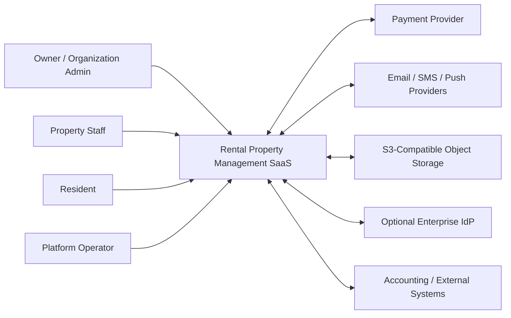
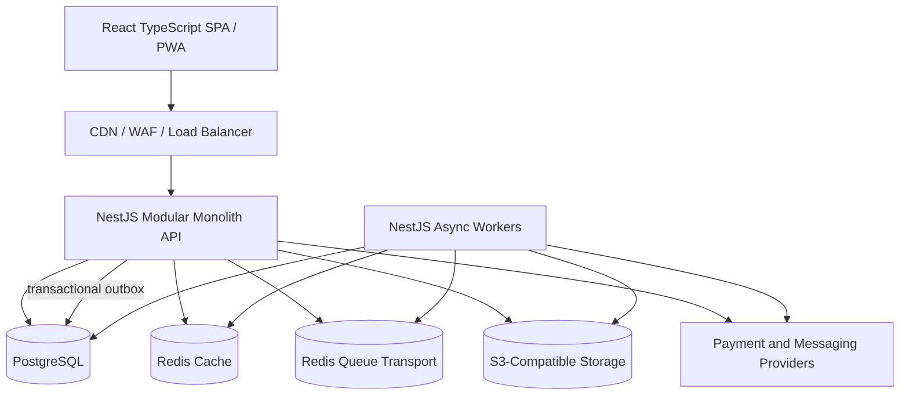

# System Architecture

## 1. Purpose and Architectural Goals

This document defines the target architecture for a commercial, multi-tenant Rental Property Management SaaS serving boarding houses and apartment operators from approximately 30 units to more than 10,000 units.

Customer-facing language uses **Organization**. Internally, organization isolation is represented by `tenant_id`; the two terms describe the same SaaS boundary. Inventory is consistently modeled as **Property > Unit > optional Bed**. There is no Room entity.

The architecture prioritizes:

- strict tenant data isolation;
- operational reliability for billing, payments, occupancy, and notifications;
- a modular product that can evolve without premature microservices complexity;
- horizontal scalability for web traffic and asynchronous workloads;
- secure handling of identities, financial records, and tenant documents;
- traceability through immutable history, audit logs, and observable workflows.

## 2. System Context

### 2.1 Actors and External Systems

| Actor or system | Primary interactions |
|---|---|
| Property owner / Organization administrator | Configures properties, units, optional beds, pricing, staff, integrations, and subscription settings |
| Property manager / staff | Manages inventory, leases, residents, services, meter readings, invoices, payments, and incidents |
| Resident / renter | Views lease and invoices, submits payments and service requests, receives notices, and accesses documents |
| Platform operator | Supports Organizations, monitors service health, manages plans, and performs controlled operational actions |
| Payment provider | Accepts payment requests and emits signed payment-status webhooks |
| Email/SMS/push providers | Deliver transactional notifications and return delivery outcomes |
| Identity provider, optional | Supports enterprise SSO through OIDC or SAML when introduced |
| Object storage | Stores documents and media using short-lived signed access |
| Accounting or business systems | Exchange invoice, payment, and ledger data through APIs, exports, or webhooks |

### 2.2 Context Diagram

## 3. Container and Component Architecture

### 3.1 Runtime Containers

| Container | Responsibility | Scaling model |
|---|---|---|
| React + TypeScript SPA/PWA | Responsive staff and resident experiences, offline-tolerant read paths, local UI state, and secure API access | CDN and edge caching |
| NestJS API | REST API, authorization, domain orchestration, validation, transactional writes, signed URL issuance, and webhook handling | Multiple stateless replicas |
| NestJS worker processes | Queue consumers for billing runs, document processing, notification delivery, exports, webhook delivery, and reconciliation | Independently scaled by queue depth and workload |
| PostgreSQL | Authoritative transactional data store | Managed primary, replicas, backups, and later partitioning |
| Redis cache | Cache, rate limiting, and ephemeral coordination; data may be evicted or rebuilt | Managed highly available service with cache-appropriate eviction |
| Redis queue | BullMQ-style delivery transport for reconstructible jobs; isolated from cache eviction and memory pressure | Managed highly available service with persistence, no-eviction policy, and queue monitoring |
| S3-compatible storage | Durable private object storage for contracts, receipts, identity documents, images, and exports | Provider-managed |

### 3.2 Backend Bounded Modules

The backend is a modular monolith. Modules own their domain rules, application services, persistence access, events, and public contracts. Cross-module access occurs through explicit module APIs or domain events, not direct access to another module's internal repositories.

| Module | Scope |
|---|---|
| Identity and Access | Users, credentials, sessions, MFA, roles, permissions, invitations, and service accounts |
| Organization and Subscription | Organizations, plans, entitlements, usage limits, branding, and platform administration; persistence uses `tenant_id` |
| Property Inventory | Properties, buildings, floors, units, beds, allocation modes, amenities, and availability |
| Parties and Ownership | Residents, Property Owners, contacts, guarantors, ownership interests, Management Agreements, identity/profile records, and party organizations such as employers or corporate payers. A Property Owner or party organization is not automatically a SaaS Organization/isolation boundary or application User. |
| Leasing and Occupancy | Applications, reservations, leases, lease parties, allocations, deposits, move-in/out, and renewals |
| Pricing and Services | Rate plans, recurring charges, utilities, service catalogs, and pricing rules |
| Billing and Ledger | Billing schedules, invoices, line items, credits, payment allocation, balances, and financial adjustments |
| Payments | Payment intents, provider transactions, refunds, reconciliation, and provider webhooks |
| Maintenance | Requests, work orders, assignments, vendors, costs, and status history |
| Communications | Templates, notices, conversations, delivery attempts, preferences, and outbound webhooks |
| Documents | File metadata, document categories, signed access, retention, and malware-scan status |
| Reporting and Exports | Read models, dashboards, scheduled exports, and large report jobs |
| Audit and Compliance | Audit events, consent, retention controls, and privileged-access records |
| Integrations | Provider adapters, integration credentials, import jobs, exports, and webhook subscriptions |

Modules may be deployed together while preserving boundaries that permit selective extraction later.

## 4. Frontend Architecture

The frontend is a React and TypeScript single-page application with progressive web application capabilities.

- **Application shells:** separate navigation and permissions for platform operators, Organization staff, and residents while sharing a design system and API client.
- **Feature organization:** frontend domains align with backend bounded modules to reduce coupling and clarify ownership.
- **Server state:** API responses are cached with explicit invalidation after mutations. `org_id` and authorization context are part of cache keys.
- **Client state:** limited to UI state, drafts, and session-safe preferences; authoritative business state remains on the server.
- **PWA behavior:** cache versioned static assets and selected non-sensitive read data. Financial mutations, lease actions, and permission changes require confirmed online execution.
- **Security:** avoid persistent storage of access tokens. Prefer in-memory access tokens and secure, HttpOnly, SameSite refresh-token cookies where browser deployment permits.
- **Performance:** route-level code splitting, virtualized large lists, image resizing, and CDN-hosted immutable assets.
- **Accessibility and localization:** WCAG-oriented components, keyboard navigation, semantic markup, locale-aware dates/currency, and Organization-configurable timezone.

## 5. Backend and Asynchronous Processing

### 5.1 Request Processing

The API is stateless. A request passes through correlation, authentication, Organization resolution, rate limiting, authorization, validation, domain orchestration, persistence, and structured response layers.

Access tokens are Organization-scoped and carry an authenticated `org_id` claim. The API resolves `org_id` through the subject's active Organization membership and maps it to the internal `tenant_id`; user-supplied `tenant_id` values are never authorization evidence. The API does not accept an `X-Tenant-ID` header or an equivalent caller-selected isolation header.

### 5.2 Transactional Outbox

Business data and an outbox event are committed in the same PostgreSQL transaction. A relay publishes committed events to the isolated Redis queue service. Queue messages carry an outbox event ID and only reconstructible dispatch data; the durable outbox remains the replay source. Redis loss may delay or duplicate delivery but must never lose a committed business event. The relay republishes unpublished or unacknowledged events, and consumers are at-least-once and idempotent.

The outbox is used for:

- invoice generation and downstream notification;
- payment status propagation and reconciliation;
- occupancy and availability read-model updates;
- document processing;
- integration and customer webhook delivery;
- audit-relevant asynchronous activity.

Events include a stable event ID, tenant ID, aggregate identity, event type, schema version, timestamp, correlation ID, and payload. Processing state and retries are retained for operational diagnosis.

### 5.3 Queue and Job Controls

- Separate queues by workload class and failure domain.
- Apply bounded retries with exponential backoff and jitter.
- Move exhausted jobs to a dead-letter state with alerting and replay controls.
- Use distributed locks only for narrowly scoped singleton operations such as a tenant billing cycle.
- Make scheduled jobs timezone-aware and persist their intended execution window.
- Enforce per-Organization concurrency limits so large Organizations cannot starve smaller Organizations.

### 5.4 Noisy-Neighbor Controls

- Enforce per-Organization API request, burst, payload-size, and expensive-operation quotas, with plan-aware ceilings and explicit `429` responses.
- Enforce per-Organization worker quotas for admitted jobs, concurrency, CPU/time budget, and retry volume. Use weighted fair or deficit-round-robin scheduling rather than processing one Organization's backlog continuously.
- Apply per-Organization storage byte/object quotas, upload-rate limits, and lifecycle enforcement.
- Cap concurrent exports and reports per Organization and globally; queue excess work and bound query/runtime/resource budgets.
- Track quota consumption and throttling by Organization, workload class, and plan. Platform emergency limits may be stricter than commercial entitlements.

## 6. Data Architecture

PostgreSQL is the system of record and Prisma is the database access and migration layer.

- Every tenant-owned row carries a non-null `tenant_id`.
- Composite foreign keys and unique constraints include `tenant_id` where practical, preventing cross-tenant references at the database boundary.
- Application repositories require tenant context and automatically scope every query by `tenant_id`; composite foreign keys prevent cross-tenant relationships. These are the primary isolation controls.
- PostgreSQL row-level security (RLS) is optional defense in depth, not a substitute for repository filters, authorization, or composite constraints. Prisma does **not** set PostgreSQL session GUCs automatically.
- If RLS is enabled, transaction middleware must open a transaction and execute transaction-local `SET LOCAL app.tenant_id` (or the parameterized `set_config` equivalent) before any tenant-owned statement, using the same pinned connection. Pool resets, worker jobs, migrations, support tools, and failure paths must be tested. RLS alone is never considered sufficient.
- Financial and lifecycle records are append-only or corrected through explicit reversal/adjustment records.
- Reporting queries use read replicas and purpose-built read models as volume grows.
- Redis is never authoritative for financial, lease, occupancy, or permission data.

The initial shared-schema model is economical and operationally simple. Large or regulated Organizations may later move to dedicated partitions, schemas, databases, or regional cells without changing domain contracts.

### 6.1 Connection and Transaction Controls

- Put PgBouncer in transaction-pooling mode between stateless application pools and PostgreSQL unless a feature requires session affinity; size aggregate application pools below the database connection budget.
- Use role/workload-specific `statement_timeout` values, shorter for interactive APIs and bounded but longer for controlled reports and migrations.
- Configure `idle_in_transaction_session_timeout` to terminate abandoned transactions.
- Enforce an application-level maximum transaction duration and emit telemetry for transactions approaching it. Do not hold database transactions open across network calls or queue waits.

### 6.2 Search Strategy

Start with tenant-scoped PostgreSQL search: normalized columns, b-tree indexes for exact/prefix business keys, `pg_trgm` GIN/GiST indexes for bounded fuzzy name/address lookup, and PostgreSQL full-text GIN indexes for approved document metadata or descriptions. Every search predicate and index access path includes `tenant_id` (often as a leading b-tree key or via tenant-partitioned/generated search data), and authorization filters are applied before ranking or pagination.

Add a dedicated search platform only when measured indexed volume, p95 latency, relevance, multilingual analysis, faceting, typo tolerance, or independent scaling cannot meet product SLOs in PostgreSQL. Migration uses outbox-fed, tenant-scoped indexes, versioned mappings, backfill/reconciliation counts, and an authorization-preserving query gateway; PostgreSQL remains authoritative.

## 7. Authentication and Authorization

### 7.1 Authentication

- Short-lived JWT access tokens identify the subject, session, token version, and Organization through an `org_id` claim, plus minimal platform claims.
- Refresh tokens are opaque, high entropy, stored only as hashes, and rotated on every use.
- Refresh-token family reuse invalidates the entire family and raises a security event.
- Sessions support device metadata, expiration, revocation, and administrative termination.
- Passwords use a modern adaptive hash; MFA is required for privileged platform roles and configurable for tenant roles.
- Key rotation uses key identifiers and an overlap window. Private signing keys reside in a managed secret or key service.

### 7.2 Authorization

Authorization combines:

- platform-level roles for SaaS operations;
- Organization membership and role-based permissions;
- property-level scope where staff manage selected properties;
- ownership rules for resident self-service;
- entitlement checks based on Organization subscription;
- contextual policies for sensitive actions, such as refunds or lease termination.

The API enforces authorization on every request. Frontend permission checks improve usability but are not security controls.

## 8. Object Storage and Document Access

Object storage buckets are private. Database records hold metadata and storage keys rather than public object URLs.

- Uploads use short-lived signed URLs with content-type, size, and key-prefix restrictions.
- Uploaded objects enter a quarantine prefix/bucket and cannot be downloaded or linked into workflows until malware scanning, file-type/content validation, and policy checks succeed. Infected or indeterminate objects remain isolated, generate an audit/security event, and are deleted or retained for investigation under policy.
- Downloads use short-lived signed URLs after tenant and object-level authorization.
- Storage keys include opaque identifiers and deployment/tenant prefixes but no sensitive names.
- Versioning, encryption at rest, lifecycle rules, legal holds, and retention policies are configured by document class.
- Legal hold overrides normal retention expiry and purge requests for the held scope. Release of a hold resumes, but does not bypass, the normal approved purge workflow.
- Deletion is asynchronous and auditable; database retention policy determines when the underlying object may be purged.

## 9. Deployment Architecture

### 9.1 Environments

Development, test, staging, and production are isolated by accounts/projects, networks, databases, Redis instances, storage buckets, secrets, and encryption keys. Production data is not copied to lower environments without approved masking.

### 9.2 Production Topology

- React assets are built once, served through object hosting and a CDN, and protected by a WAF.
- API and worker images are immutable Docker containers.
- A managed container platform runs API replicas across availability zones.
- Worker pools scale independently by queue and resource profile.
- Managed PostgreSQL provides automated backups, point-in-time recovery, encryption, failover, and read replicas.
- Cache and queue Redis concerns use separate instances or strongly isolated clusters. Cache permits bounded eviction; queue transport uses persistence, backups where supported, no-eviction behavior, and outbox-based reconstruction.
- Managed S3-compatible storage provides cross-zone durability.
- Secrets are injected at runtime from a secret manager and never baked into images.
- Database migrations run as a controlled release step before compatible application rollout.

Deployments use health checks, rolling or canary updates, backward-compatible schema changes, and rapid rollback. Destructive schema changes follow expand-migrate-contract sequencing.

## 10. Observability

All components emit correlated telemetry using a shared request/correlation ID, tenant identifier where policy permits, and deployment version.

| Signal | Requirements |
|---|---|
| Logs | Structured JSON, centralized collection, redaction of secrets and personal data, tenant-aware search controls |
| Metrics | Request rate, latency, errors, saturation, queue depth/age, job outcomes, connection pools, cache effectiveness, and business workflow indicators |
| Traces | Distributed traces across API, database, Redis, queues, object storage, and external provider calls |
| Audit | Immutable records for authentication, authorization-sensitive actions, configuration changes, data exports, and financial corrections |
| Alerts | SLO burn rate, payment failures, billing delays, dead letters, webhook backlog, database pressure, and security anomalies |

Initial service-level objectives should cover API availability, interactive latency, successful billing completion, notification delay, and recovery point/recovery time. Synthetic checks validate login, critical API reads, and a non-financial workflow.

Read models have explicit freshness SLOs. As a baseline, occupancy and availability dashboards disclose their last-updated time and remain no more than 60 seconds behind committed events under normal load; financial balance views target 60 seconds unless the workflow requires a synchronous authoritative read. Alerts fire on oldest-event age, and critical screens fall back to authoritative queries or clearly show degraded/stale status.

## 11. Reliability and Recovery

- Design for at-least-once event and webhook delivery with idempotent consumers.
- Apply timeouts, bounded retries, jitter, and circuit breakers to external calls.
- Protect PostgreSQL with connection pooling and transaction time limits.
- Use graceful shutdown so deployments stop accepting traffic and finish or safely release work.
- Back up PostgreSQL with point-in-time recovery and run automated restore tests plus scheduled full recovery exercises. Verify row counts/checksums, tenant isolation, encryption-key availability, and application smoke tests; record achieved RPO/RTO.
- Enable storage versioning and replication according to document criticality.
- Reconcile payment-provider state independently of webhook delivery.
- Maintain runbooks for database failover, queue backlog, compromised credentials, billing replay, and provider outage.
- Test disaster recovery and record achieved recovery point and recovery time objectives.

The commercial baseline is **RPO ≤ 15 minutes** and **RTO ≤ 4 hours** for core transactional service, explicitly approved and validated through recovery exercises. An optional higher-availability tier may target tighter objectives (for example RPO ≤ 5 minutes and RTO ≤ 1 hour) only with corresponding multi-zone/region architecture, operational coverage, tested failover, and pricing.

## 12. Security Architecture

- TLS is mandatory in transit; managed services and storage use encryption at rest.
- Network policies expose only edge endpoints. Databases, Redis, and worker control surfaces remain private.
- Least-privilege identities are distinct for API, workers, migrations, and operational access.
- Tenant scope is enforced in application repositories, authorization policies, database constraints, and optionally row-level security.
- Input validation, parameterized database access, and contextual output encoding address injection risks. A restrictive Content Security Policy uses nonces/hashes and disallows unsafe script execution except for documented exceptions.
- CORS uses an explicit production-origin allowlist and never reflects arbitrary origins with credentials. Cookie-based refresh endpoints use Secure, HttpOnly, SameSite cookies plus CSRF tokens and Origin/Referer validation.
- WAF rules and application controls detect credential stuffing, token-refresh abuse, enumeration, oversized requests, and repeated/bulk export attempts. Auth and export limits combine IP, account, session, Organization, and risk signals.
- Rate limits and abuse controls apply by IP, user, session, tenant, and high-risk operation.
- Sensitive fields are classified, minimized, redacted from logs, and optionally encrypted at the application field level.
- Signed webhooks are timestamped and protected against replay.
- Dependencies and container images undergo vulnerability and license scanning; builds produce an SBOM.
- Privileged support access is time-bound, approved, auditable, and visible to affected tenants where policy requires.
- Data retention and deletion workflows distinguish business records, legal obligations, audit evidence, and user-requested erasure.

### 12.1 High-Level Threat Model (STRIDE)

| Area | Primary threats | Required mitigations |
|---|---|---|
| Tenancy | Spoofed Organization context, cross-tenant tampering/disclosure, repudiation of privileged access, bulk-export denial of service, support-role elevation | Signed `org_id` claim validated against membership; mandatory `tenant_id` repository filters and composite FKs; optional correctly scoped RLS; immutable audit; least privilege; per-Organization quotas |
| Payments | Spoofed/replayed webhooks, amount or allocation tampering, repudiated refunds, payment-data disclosure, provider flooding, privilege escalation | Signature/timestamp verification, provider-event idempotency, immutable ledger/reversals, dual control for sensitive actions, tokenization, reconciliation, rate limits |
| Documents | Malicious upload spoofing, object replacement, access repudiation, PII disclosure, scan/export exhaustion, signed-URL privilege abuse | Quarantine and malware scanning, checksums/versioning, private storage and short-lived signed URLs, object-level authorization, audit, storage/export quotas, legal holds |

Threat modeling is repeated for material architecture changes and before enabling new payment providers, document types, or cross-Organization administrative workflows.

## 13. Scalability Strategy

### 13.1 Initial Scale

The modular monolith, shared PostgreSQL database, stateless API replicas, and separate workers support the initial market efficiently. Optimize query design, indexes, connection use, caching, and asynchronous execution before adding distributed-system complexity.

Capacity tests include a representative large Organization with **10,000 units** (and optional beds), approximately **12,000 active leases**, **15,000 invoices per month**, **20,000 meter readings per month**, and **500 concurrently active users**, plus smaller Organizations running concurrently. Test month-start billing bursts, payment webhooks, occupancy dashboard refresh, document uploads, and exports. These are planning assumptions, not contractual limits; production measurements drive pool, quota, partition, and cell decisions.

### 13.2 Growth Techniques

1. Scale API replicas horizontally behind the load balancer.
2. Scale worker pools independently based on queue depth, oldest-job age, CPU, and memory.
3. Add read replicas and route safe reporting/read workloads away from the primary.
4. Build denormalized read models for occupancy, balances, and dashboards.
5. Partition high-volume tables by time and/or tenant hash, especially audit, outbox, meter reading, notification, and ledger history.
6. Introduce per-tenant quotas, weighted queue fairness, and workload admission controls.
7. Place tenants into regional or capacity cells while preserving stable public APIs.
8. Extract a module only when its scaling, availability, security, data residency, or team ownership differs materially from the core.

### 13.3 Explicit Evolution Triggers

| Evolution | Trigger indicators |
|---|---|
| Add PostgreSQL read replicas | Sustained read pressure affects write latency; reporting exceeds approximately 20% of primary load; replica-safe queries are identifiable |
| Add table partitioning | A table reaches hundreds of millions of rows, vacuum/index maintenance misses windows, retention deletes are expensive, or tenant/time pruning materially reduces scans |
| Move a tenant to dedicated database or cell | Tenant contributes roughly 10–20% of load, requires data residency or dedicated encryption/backup policy, or causes unacceptable noisy-neighbor risk |
| Introduce regional cells | Regulatory residency, latency objectives across continents, or blast-radius targets cannot be met by one region |
| Extract a module as a service | It needs independent scaling by an order of magnitude, separate availability/SLO, distinct compliance boundary, or autonomous team ownership; extraction benefit must exceed distributed transaction cost |
| Replace/augment Redis queue transport | Queue durability, throughput, replay horizon, ordering, or cross-region requirements exceed the managed Redis/BullMQ operational envelope |
| Add search platform | Tenant-scoped indexed PostgreSQL search misses its agreed p95 latency/relevance target at representative volume after query/index tuning, or required faceting, typo tolerance, and multilingual analysis exceed PostgreSQL's responsible operational envelope |
| Add analytics warehouse | Historical aggregation harms OLTP performance, dashboard freshness can be asynchronous, or cross-tenant product analytics needs isolated governance |
| Introduce dedicated identity service/provider | Enterprise federation, compliance certification, or authentication feature breadth exceeds responsible in-house operation |
| Split frontend applications | Staff, resident, and platform surfaces develop independent release cadences, teams, security boundaries, or performance budgets |

These are decision signals, not automatic thresholds. Each evolution requires measured evidence, an operational ownership plan, and a migration/rollback strategy.

## 14. Architectural Guardrails

1. PostgreSQL remains the source of truth for business state.
2. Every tenant-owned operation has explicit tenant context.
3. Cross-module contracts are explicit and versionable.
4. External side effects originate from committed outbox events.
5. Consumers, scheduled jobs, and webhook handlers are idempotent.
6. Object access is private and authorization precedes signed URL issuance.
7. Schema changes are backward compatible during rollout.
8. New infrastructure is introduced against measured constraints and explicit evolution triggers.
