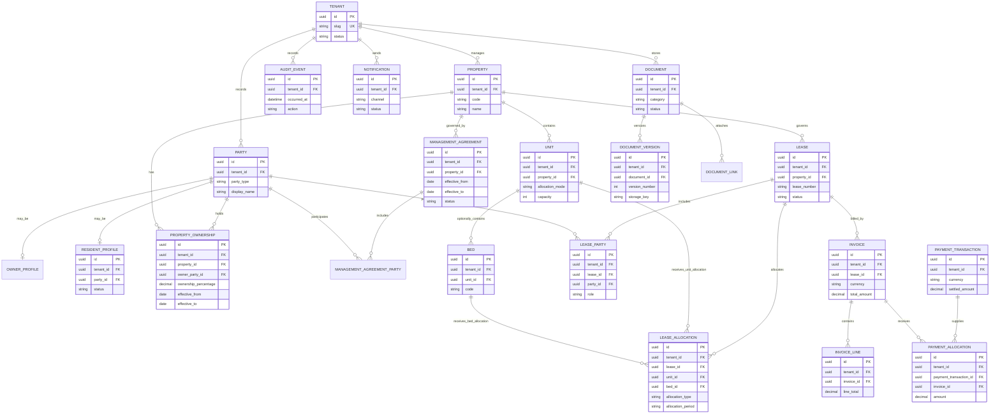
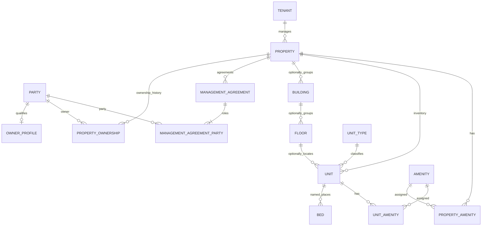
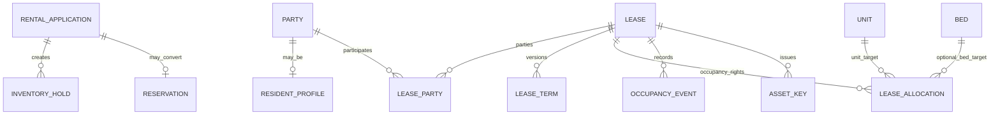
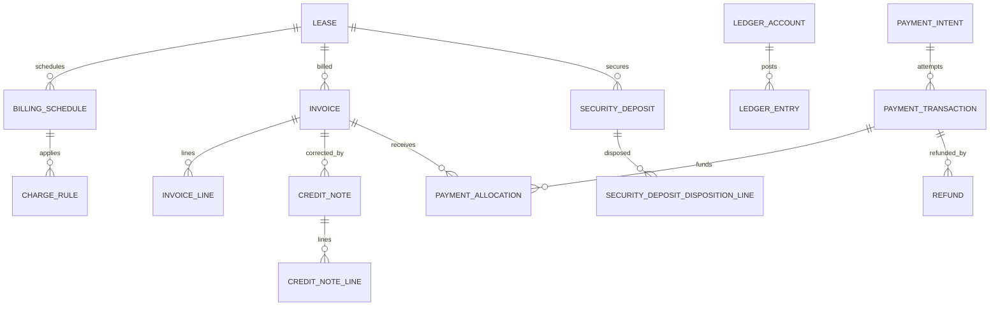
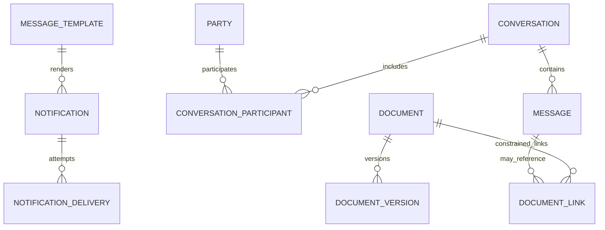

# Rental Property Management SaaS — Database Design

**Document ID:** RPM-DB-03  
**Status:** Production design baseline  
**Audience:** Architecture, backend, data, security, operations, QA, and implementation teams  
**Related documents:** [00 — Product Overview](./00-overview.md) · [01 — Business Requirements](./01-business-requirements.md) · [02 — System Architecture](./02-system-architecture.md) · [11 — Design Review Findings](./11-design-review-findings.md)

## 1. Executive decisions and scope

PostgreSQL is the authoritative transactional store. Prisma supplies typed application access and migration history, while reviewed SQL migrations provide PostgreSQL features Prisma cannot faithfully declare, including partial indexes, expression indexes, GiST exclusion constraints, constraint triggers, and Row-Level Security (RLS) if adopted.

The following decisions are normative:

1. A customer-facing **Organization** is the SaaS operator account and isolation boundary. Its internal root row is `tenants`, and all Organization-owned rows use the immutable `tenant_id`.
2. A **Property Owner** is a person or legal entity represented by `parties` plus `owner_profiles`; an owner is not the SaaS tenant unless independently contracted as an Organization.
3. A **Resident** or **Leaseholder** is represented by `parties` and, for a resident, `resident_profiles`. Customer-facing material never calls a renter a tenant.
4. One Organization manages any number of Properties. A Property may have multiple effective-dated owners, and one owner may hold interests in many Properties.
5. Canonical inventory is **Property > Unit > optional Bed**. A Unit represents an apartment, studio, private room, or shared room. There is no Room table.
6. All authoritative monetary amounts use `NUMERIC(19,4)` and an explicit ISO 4217 currency. Binary floating point is prohibited.
7. IDs are globally unique UUIDs. Lists are cursor-paginated. “Unlimited” means no product-level hard cardinality cap, not unbounded storage, throughput, concurrency, or service consumption.
8. Posted finance, executed lease facts, ownership history, and audit evidence are immutable or corrected by additive reversal/supersession records.
9. The initial topology is a shared database/schema. The model supports time partitioning, tenant-hash partitioning, regional cells, and qualifying dedicated Organization cells without changing public identities.

### 1.1 Explicit scope

This design covers SaaS access, portfolio ownership, inventory, leasing and occupancy, resident billing, utilities, payments, maintenance, communication, documents, integrations, operational reliability, retention, and audit. It supports owner attribution and management agreements but not owner distribution calculations, statutory trust accounting, payroll, full general ledger, tax filing, payment-card custody, or universal jurisdictional compliance. `ledger_entries` is a controlled resident-account posting journal, not a promise of a complete corporate accounting system.

## 2. Terminology disambiguation

| Term | Meaning | Primary representation | Explicit non-meaning |
|---|---|---|---|
| Organization / SaaS tenant | Customer operator account, subscription, security, configuration, and row-isolation boundary | `tenants`; internal key `tenant_id` | Not a Property Owner or renter |
| Property Owner | Person or legal entity with an effective ownership/beneficial interest | `parties`, `owner_profiles`, `property_ownerships` | Not automatically the Organization |
| Resident | Person who lives or will live at a Property | `parties`, `resident_profiles` | Never the SaaS tenant |
| Leaseholder | Party contractually responsible under a Lease; may be a person or legal entity | `lease_parties` with a responsible role | Not necessarily every occupant |
| Property | Physical managed site or operational location | `properties` | Not a database or tenant boundary |
| Unit | Apartment, studio, private room, or shared room | `units` | Not subdivided into a Room entity |
| Bed | Optional named assignable place in a shared Unit | `beds` | Not required for capacity-mode occupancy |
| Lease | Date-effective occupancy and financial agreement | `leases`, `lease_terms`, `lease_parties`, `lease_allocations` | Not the Resident identity |

## 3. Design principles and shared columns

### 3.1 Principles

- **Organization isolation:** tenant-owned parents expose a tenant-complete candidate key such as `(tenant_id, id)`; child foreign keys carry the same `tenant_id`.
- **Explicit domains:** people/legal entities, SaaS Organizations, physical inventory, contracts, money movement, and files remain separate.
- **Effective dating:** ownership, agreements, lease participation, terms, services, rates, and statuses preserve `[effective_from, effective_to)` history.
- **Bitemporal clarity where material:** `effective_at` states when a fact applies; `recorded_at` states when the platform learned or posted it.
- **Typed core data:** JSONB is limited to bounded provider payloads, versioned event data, and non-critical preferences. Core joins, authorization, money, status, and reporting fields are typed.
- **Additive correction:** posted or executed facts use reversal, replacement, supersession, or correcting event links.
- **Database-backed invariants:** application validation gives clear errors; PostgreSQL remains the final concurrency and integrity boundary.
- **Rebuildable projections:** cached balances, availability summaries, and dashboards identify their source of truth and reconciliation path.

### 3.2 Shared columns

Unless an entry states otherwise, Organization-owned mutable tables include:

| Column | Convention |
|---|---|
| `id` | UUID primary key generated by the platform; globally unique and never reused |
| `tenant_id` | UUID, non-null; references `tenants.id` and leads tenant-scoped keys/indexes |
| `created_at`, `updated_at` | `timestamptz`, UTC, non-null |
| `created_by_user_id`, `updated_by_user_id` | Nullable platform-user attribution where a human may act |
| `version` | Positive integer for optimistic concurrency on mutable aggregates |
| `status` | Explicit controlled lifecycle value; never inferred from unrelated null fields |
| `deleted_at`, `deleted_by_user_id` | Present only for approved soft-deletable master data |

Additional conventions:

- Date-only contractual values use PostgreSQL `date`; instants use `timestamptz`; business scheduling retains an IANA timezone.
- Periods are start-inclusive/end-exclusive. Open-ended periods use a null upper bound or canonical range infinity consistently.
- Money columns are `NUMERIC(19,4)` with adjacent currency, positive/negative semantics explicitly defined, and named rounding policies.
- Tenant-local business identifiers use unique keys beginning with `tenant_id`; active reusable identifiers use reviewed partial uniqueness (`WHERE deleted_at IS NULL`).
- Sensitive identifiers store encrypted values and approved deterministic lookup tokens separately; plaintext is never indexed or logged.
- Foreign-key delete behavior defaults to `RESTRICT`. Historical parents are retired, not cascaded away.

## 4. Complete entity inventory by domain

| Domain | Entities |
|---|---|
| Platform and access | `tenants`, `tenant_settings`, `subscription_plans`, `tenant_subscriptions`, `users`, `user_credentials`, `user_sessions`, `refresh_tokens`, `tenant_memberships`, `roles`, `permissions`, `role_permissions`, `membership_roles`, `property_access_grants`, `invitations`, `mfa_methods` |
| Platform topology and usage | `deployment_cells`, `tenant_placements`, `tenant_usage_counters` |
| Ownership and portfolio | `parties`, `party_contacts`, `party_identifiers`, `resident_profiles`, `owner_profiles`, `properties`, `property_ownerships`, `management_agreements`, `management_agreement_parties`, `buildings`, `floors`, `unit_types`, `units`, `beds`, `amenities`, `property_amenities`, `unit_amenities`, `inventory_status_history`, `rate_plans` |
| Leasing and occupancy | `rental_applications`, `inventory_holds`, `reservations`, `waitlist_entries`, `do_not_rent_flags`, `leases`, `lease_terms`, `lease_parties`, `lease_allocations`, `lease_status_history`, `occupancy_events`, `asset_keys` |
| Billing and utilities | `service_catalog_items`, `lease_services`, `meters`, `meter_readings`, `tariffs`, `utility_allocation_runs`, `billing_schedules`, `charge_rules`, `late_fee_policies`, `invoices`, `invoice_lines`, `invoice_status_history`, `credit_notes`, `credit_note_lines`, `ledger_accounts`, `ledger_entries`, `opening_balance_entries`, `balance_snapshots`, `security_deposits`, `security_deposit_disposition_lines` |
| Payments | `payment_intents`, `payment_transactions`, `payment_allocations`, `refunds`, `payment_plans`, `payment_plan_installments`, `provider_webhook_events`, `reconciliation_runs`, `reconciliation_items` |
| Maintenance | `maintenance_requests`, `work_orders`, `work_order_assignments`, `vendors`, `work_order_costs`, `maintenance_status_history`, `inspections`, `inspection_items` |
| Communication and documents | `message_templates`, `notifications`, `notification_deliveries`, `conversations`, `conversation_participants`, `messages`, `documents`, `document_versions`, `document_links` |
| Integration and platform operations | `integration_connections`, `webhook_subscriptions`, `webhook_deliveries`, `import_jobs`, `export_jobs`, `outbox_events`, `processed_messages`, `scheduled_jobs`, `idempotency_keys`, `audit_events`, `data_retention_actions`, `privileged_access_events` |

## 5. High-level entity-relationship model

The diagram shows commercial boundaries and principal transaction paths. The physical table is `TENANT`; product language presents the same row as an Organization.

## 6. Domain relationship diagrams

### 6.1 Ownership and inventory

### 6.2 Lease and occupancy

### 6.3 Finance

### 6.4 Communication and documents

## 7. Table catalog

Each row below describes one table independently. “Retain” always remains subject to configured policy, contract, jurisdiction, privacy rights, and legal hold.

### 7.1 Platform and access

| Table | Purpose and important columns | Key constraints and indexes | Primary relationships | Lifecycle and retention |
|---|---|---|---|---|
| `tenants` | Internal row for one customer-facing Organization; `slug`, legal/display name, status, default currency/locale/timezone, `data_region`. | Global unique slug; valid lifecycle, currency, and timezone; status index. | Root of all tenant-owned data; one-to-many Properties and memberships. | Never ordinary-deleted; closure drives export, hold checks, anonymization, and eventual purge. |
| `tenant_settings` | Versioned Organization configuration: branding, numbering, calendars, policies, feature settings. | Unique `(tenant_id, setting_key, effective_from)` or typed singleton keys; effective-range checks. | Belongs to one tenant; referenced versions may be snapshotted by transactions. | Supersede rather than overwrite materially used settings; retain versions needed to explain history. |
| `subscription_plans` | Platform-owned commercial plan definitions, entitlements, measurement rules, and published versions. | Globally unique plan/version code; no nullable tenant scope; effective-date indexes. | One plan version to many subscriptions. | Retire, never rewrite versions used by subscriptions. |
| `tenant_subscriptions` | Organization trial, renewal, billing-provider reference, plan version, limits, and status history anchors. | One current subscription per tenant/product; provider-reference uniqueness; date checks. | Belongs to tenant and plan. | Status/effective history retained for commercial audit; separate from resident finance. |
| `users` | Platform identity shared across Organizations; normalized email, status, profile, token version. | Global unique normalized email; status indexes. | Has credentials, sessions, MFA methods, memberships. | Disable/anonymize under identity policy; audit references remain pseudonymous. |
| `user_credentials` | Password or federated credential metadata; hash, provider subject, algorithm/version, changed/revoked times. | Unique provider/subject; one active local credential; never stores plaintext. | Belongs to user. | Rotate/revoke; retain bounded security history, then purge safely. |
| `user_sessions` | Server-side session and device context; current Organization, family state, assurance, expiry, revocation. | Session ID unique; expiry/revocation indexes; current tenant must match active membership when set. | Belongs to user; parent of refresh tokens. | Revoke, then retain briefly for investigations and reuse detection before purge. |
| `refresh_tokens` | Hash-only rotating refresh token records; family, issued, consumed, replaced-by, expiry, revocation. | Token hash unique; replacement chain and atomic single consumption; family index. | Belongs to session. | Short security retention after expiry/revocation; raw token never retained. |
| `tenant_memberships` | User access to one Organization; status, workforce/resident access class, effective dates. | Unique active `(tenant_id, user_id, membership_type)`; composite tenant keys. | Joins tenant and user; owns role and property grants. | Deactivate rather than erase when referenced by audit or approvals. |
| `roles` | System template or Organization-defined role; key, name, maximum scope, status. | Tenant-local active name/key uniqueness; platform roles separated; no cross-tenant assignment. | Has permissions and membership assignments. | Retire after assignments migrate; preserve versions/attribution for audit. |
| `permissions` | Platform-owned versioned permission catalog and risk classification. | Globally unique stable permission key. | Many-to-many roles through `role_permissions`. | Append/deprecate keys; never silently broaden historical meaning. |
| `role_permissions` | Explicit role-to-permission grant with optional effective/expiry metadata. | Unique `(role_id, permission_id)` within correct ownership class. | Joins role and permission. | Changes audited; historical evidence retained or versioned. |
| `membership_roles` | Assigns role to membership with scope and effective dates. | Tenant-complete FKs; no overlapping duplicate active assignment; expiry index. | Joins membership and role; property scope delegated separately. | End-date/revoke rather than delete; preserve approver and assignment history. |
| `property_access_grants` | Restricts a membership/role assignment to selected Properties. | Unique active `(tenant_id, membership_id, property_id)`; Property must share tenant. | Belongs to membership and Property. | Revoke/end-date; retained for access reviews. |
| `invitations` | Single-use workforce or resident invitation; intended identity, purpose, tenant, proposed access, token hash, expiry. | Token hash unique; purpose separation; one-time acceptance; tenant/email indexes. | May create/link user and membership; resident invitation links explicit party/lease context. | Expire/revoke/consume; retain metadata, not raw token, for bounded audit period. |
| `mfa_methods` | Registered TOTP, WebAuthn/passkey, or recovery factor metadata and security state. | Credential ID unique; encrypted secret where necessary; recovery values hash-only. | Belongs to user. | Disable/rotate; retain bounded enrollment/removal evidence. |
| `deployment_cells` | Platform-owned regional/capacity cell; code, provider region, status, capacity class, encryption/recovery boundary metadata. | Globally unique cell code; no tenant scope; status and region indexes. | Parent of tenant placements and platform routing metadata. | Retire only after all placements migrated; retain placement history. |
| `tenant_placements` | Effective-dated mapping of an Organization to a deployment cell and database/storage region; migration state, placement reason, status. | At most one active placement per tenant; unique `(tenant_id, effective_from)`; cell/tenant/status indexes. | Belongs to tenant and deployment cell. | Append/end-date; public Organization IDs remain stable across placement changes. |
| `tenant_usage_counters` | Measured usage and soft-entitlement counters (units, residents, storage, exports, jobs) for quota enforcement without product-fixed cardinality caps. | Unique `(tenant_id, counter_key, period_start)` or rolling snapshot key; tenant/time indexes. | Belongs to tenant; referenced by subscription/entitlement policy. | Regenerable from source tables; retain bounded history for billing and noisy-neighbor analysis. |

### 7.2 Ownership and portfolio

| Table | Purpose and important columns | Key constraints and indexes | Primary relationships | Lifecycle and retention |
|---|---|---|---|---|
| `parties` | Organization-local person or legal entity; type, legal/display/preferred names, status, merge target. | Tenant-scoped duplicate/search indexes; type-specific checks; globally unique ID. | Parent of contacts, identifiers, profiles, ownerships, lease roles, and agreement roles. | Merge/anonymize under policy; durable business references remain. |
| `party_contacts` | Email, phone, postal, emergency contact, preference, consent, verification, validity period. | Normalized tenant/type/value indexes; one preferred contact per purpose where required. | Belongs to party. | End-date or redact; consent and opt-out evidence retained as legally required. |
| `party_identifiers` | Sensitive government/business identifiers; type, issuer, encrypted value, lookup token, key version, verification. | Approved uniqueness by tenant/type/issuer/token; plaintext prohibited from indexes/logs. | Belongs to party. | Restrict and cryptographically erase/anonymize when eligible; access audited. |
| `resident_profiles` | Resident-specific status, portal linkage policy, screening/communication preferences; one per resident party. | Unique `(tenant_id, party_id)`; party must be a person where policy requires. | Extends party; participates in occupancy through lease parties. | Deactivate/anonymize without deleting lease or finance history. |
| `owner_profiles` | Owner-specific classification, reporting preferences, tax/contact metadata, verification status. | Unique `(tenant_id, party_id)`; legal-entity/person rules; restricted tax data. | Extends party; parent concept for property ownership and agreement roles. | Retire, retain while ownership/agreement history exists; sensitive fields minimized. |
| `properties` | Managed site; code, name, type, structured address, timezone, status, operational settings. | Active code unique per tenant; `(tenant_id,status)` and address/search indexes. | Belongs to tenant; has ownerships, agreements, Units, leases, meters. | Archive/retire when history exists; deletion blocked by active obligations. |
| `property_ownerships` | Effective-dated many-to-many Property/owner interest; interest type, percentage, effective period, source evidence. | Tenant-complete FKs; unique owner/property/type/period; range index; share invariant described in §9. | Joins Property and owner party. | Append/supersede, never rewrite executed history; retain with property records. |
| `management_agreements` | Effective contract under which the Organization manages a Property; term, status, fee/reporting metadata, agreement reference. | Tenant/Property/date indexes; valid non-overlapping current agreement rules per agreement type. | Belongs to Property; has agreement parties and documents. | Version/end-date; retain contract and termination history; no payout engine implied. |
| `management_agreement_parties` | Assigns owner, operator, agent, beneficiary, or signer roles to an agreement with effective dates. | Unique active agreement/party/role; tenant-complete FKs. | Joins management agreement and party. | End-date rather than delete after execution; retain signature/authority evidence. |
| `buildings` | Optional physical grouping within a Property; code, name, order, status. | Active code unique per Property; tenant/Property index. | Belongs to Property; optionally has floors and Units. | Archive; Units preserve historical location reference. |
| `floors` | Optional building/property level metadata; label, sort order, status. | Parent-consistent building/property; unique active label within parent. | Belongs to building/Property; optionally locates Units. | Archive; no cascade to Units. |
| `unit_types` | Tenant-defined classification for apartment, studio, private/shared room; default capacity/allocation/rate behavior. | Active code/name unique per tenant; valid allocation defaults. | Classifies Units and may relate to rate plans. | Retire; Units and historical pricing retain reference/snapshot. |
| `units` | Canonical rentable space; Property, optional building/floor/type, code, allocation mode, capacity, attributes, status. | Active code unique per Property; capacity > 0; tenant-complete parents; Property/status/mode indexes. | Belongs to Property; has optional Beds, allocations, meters, amenities. | Archive/retire; blocked while current/future holds or allocations exist. |
| `beds` | Optional named assignable place in a shared Unit; code, label, status. | Active code unique per Unit; allocatable only for BED-mode Unit; tenant-complete Unit FK. | Belongs to Unit; targeted by holds and lease allocations. | Retire; no deletion while referenced by current/future occupancy. |
| `amenities` | Reusable tenant-defined amenity definition; code, name, category, status. | Active code unique per tenant; category index. | Linked through Property/Unit junctions. | Retire; historical links remain. |
| `property_amenities` | Effective assignment of amenity to Property with optional value/quantity. | Unique active Property/amenity; tenant-complete FKs. | Joins Property and amenity. | End-date/remove only when not needed historically. |
| `unit_amenities` | Effective assignment of amenity to Unit with optional value/quantity. | Unique active Unit/amenity; Unit and amenity share tenant. | Joins Unit and amenity. | End-date; preserve snapshots used in offers/contracts where required. |
| `inventory_status_history` | Append-only operational state changes for Property/Unit/Bed; effective/recorded times, reason, actor. | Exactly one constrained target type/FK path; parent/time index; immutable ordering. | Uses separate nullable typed FKs with a check, never generic entity ID. | Long-lived operational history; corrections append superseding events. |
| `rate_plans` | Effective-dated pricing defaults for Property/Unit type/Unit; currency, cadence, amount, deposit and proration policy. | One explicit typed scope; valid periods; tenant/scope/effective indexes. | Referenced by Units, applications, reservations, and lease-term snapshots. | Supersede; never alter a version used by an activated Lease. |

### 7.3 Leasing and occupancy

| Table | Purpose and important columns | Key constraints and indexes | Primary relationships | Lifecycle and retention |
|---|---|---|---|---|
| `rental_applications` | Applicant demand, desired Property/inventory criteria, status, decision evidence, source, submitted time. | Tenant/property/status indexes; stable external/import reference; human decision required. | Links applicant parties and may create holds/reservations/Lease. | Preserve decision trail; anonymize screening data on shorter policy where allowed. |
| `inventory_holds` | Expiring soft claim on Unit, Bed, or capacity; period, quantity, priority, expiry, status. | Exactly one valid resource mode; range indexes; atomic expiry/conversion; dedupe key. | Belongs to application/party and inventory resource. | Short-lived; retain conversion/cancellation evidence, purge stale detail by policy. |
| `reservations` | Hard blocking pre-Lease commitment; resource, period, capacity, deposit/reference, status. | Uses allocation overlap/capacity semantics; idempotent conversion; tenant-complete FKs. | Links application/party, inventory, and resulting Lease. | End as converted/cancelled/expired; retain commercial history. |
| `waitlist_entries` | Date-ordered demand by Property/type/criteria; party/application, preferences, priority, consent, expiry. | Tenant/property/status/created index; no guaranteed allocation rank. | Links party/application and optional Property/type. | Expire/remove with reason; minimize contact data after close. |
| `do_not_rent_flags` | Restricted manual decision-support flag; category, evidence, review/expiry, visibility, disposition. | Party/active-review index; reason/evidence mandatory; no automated adverse decision. | Belongs to party and references authorized evidence/document. | Time-bounded, access-audited, correctable; purge/anonymize per privacy policy. |
| `leases` | Contract aggregate; Property, immutable number after activation, status, currency, dates, liability model, billing context. | Unique `(tenant_id,lease_number)`; date/status/currency checks; Property/status indexes. | Has terms, parties, allocations, invoices, deposits, events. | Drafts may be removed before dependencies; activated Leases retained read-only. |
| `lease_terms` | Versioned commercial/legal terms; rent, deposit, cadence, proration, notice, liability, effective period, approval/signature state. | Ordered versions; valid effective periods; one effective version per dimension; currency fixed after posting. | Belongs to Lease; references source rate/policy versions. | Immutable after activation; amendment creates new version. |
| `lease_parties` | Effective role of party as primary Leaseholder, occupant, guarantor, payer, or sponsor; liability share/cap. | Tenant-complete Lease/party FKs; role/effective indexes; activation requires Leaseholder. | Joins Lease and party. | End-date; retain contractual participation and responsibility history. |
| `lease_allocations` | Effective Unit, named-Bed, or capacity assignment; allocation type, quantity, canonical range, status. | Mode checks; Bed must belong to Unit; GiST exclusions and capacity lock/recheck; resource/range indexes. | Belongs to Lease and Unit; optional Bed. | End/cancel, never delete after activation; corrections append replacements. |
| `lease_status_history` | Append-only Lease transition; from/to, effective/recorded time, actor, reason, policy version. | Valid transition and sequence; Lease/time index; immutable. | Belongs to Lease. | Retain for Lease/legal history; corrections append. |
| `occupancy_events` | Physical move-in/out, transfer, holdover, absence, surrender, and capacity changes distinct from contract state. | Typed event; effective/recorded times; Lease/resource indexes; causal ordering. | Belongs to Lease/allocation and inventory; may reference inspection. | Append-only multi-year occupancy evidence. |
| `asset_keys` | Itemized keys, cards, furnishings, or access assets issued/returned; identifier, condition, custodian, dates, status. | Identifier unique within tenant/Property while active; quantity and custody checks. | Links Property/Unit, Lease, party, and checkout/return evidence. | Retain custody history; sensitive access identifiers rotated/redacted when retired. |

### 7.4 Billing and utilities

| Table | Purpose and important columns | Key constraints and indexes | Primary relationships | Lifecycle and retention |
|---|---|---|---|---|
| `service_catalog_items` | Billable rent-adjacent service definition; code, name, calculation type, tax category, default currency/rate. | Active code unique per tenant; typed calculation rules. | Source for lease services and charge rules. | Version/retire; posted lines retain snapshots. |
| `lease_services` | Effective service subscription/assignment to a Lease or beneficiary inventory; quantity, rate override, cadence. | Valid effective range; service/Lease/currency checks; scope/effective indexes. | Joins Lease and service item; feeds billing. | End-date; retain versions used for charges. |
| `meters` | Physical/logical utility source; type, serial, unit of measure, multiplier, effective assignment and status. | Exactly one approved scope (Property, Unit, shared service); scoped serial uniqueness. | Belongs to tenant and typed Property/Unit scope; has readings. | Retire/replace; preserve reading lineage. |
| `meter_readings` | Append-only value at `read_at`; source, quality, evidence, reset/rollover/correction link, import provenance. | Unique meter/time/source key; monotonic rule with explicit exceptions; meter/time descending index. | Belongs to meter; consumed by utility runs. | Never destructively edit after billing; partitionable and archived by time. |
| `tariffs` | Effective utility pricing version; fixed, flat, tiered, consumption, minimum, tax, rounding rules. | Valid non-overlapping effective versions per scope; typed components and currency. | Referenced by utility allocation runs/invoice lines. | Immutable once used; supersede future versions. |
| `utility_allocation_runs` | Reproducible allocation for service period; inputs, readings, method/version, totals, status, rounding/residual. | Unique successful scope/period/version; totals reconcile; property/period and status indexes. | Uses meters/readings/tariff; creates invoice lines/ledger events. | Finalized runs immutable; reverse/supersede with lineage. |
| `billing_schedules` | Timezone-aware recurring obligation schedule; Lease/scope, cadence, next run, effective dates, status. | Unique logical schedule; next-run partial index; valid timezone/period. | Belongs to Lease/Property and owns charge rules. | End-date; retain schedule versions tied to posted charges. |
| `charge_rules` | Effective calculation rule for rent, fee, service, tax, discount, or utility; amount/rate, source and posting key. | Typed scope/calculation; valid period; unique logical source/period posting key. | Belongs to schedule/service/policy; generates invoice lines and ledger entries. | Supersede; posted use snapshots exact inputs/version. |
| `late_fee_policies` | Effective grace, flat/percentage method, cap, cadence, jurisdiction/tax treatment, precedence. | Nonnegative values; one deterministic scope; non-overlapping versions. | Applied to Lease/Property/tenant billing and snapshotted by charge. | Immutable once assessed; supersede only prospectively. |
| `invoices` | Issued presentation of charges; immutable number, Lease/bill-to party, dates, status, currency, totals, controlled balance cache. | Number unique per tenant; arithmetic/currency checks; lease/date and open-aging indexes. | Belongs to Lease/party; has lines, status history, credits, payment allocations. | Draft mutable; posted immutable; void/correct additively; long-term retention. |
| `invoice_lines` | Immutable posted charge detail; description, service period, quantity, unit price, tax, total, source/version. | Arithmetic checks; unique source posting key; invoice currency consistency. | Belongs to invoice; references typed source columns where modeled. | Draft edits allowed; posted lines corrected by credit/replacement. |
| `invoice_status_history` | Append-only invoice lifecycle transition; from/to status, effective/recorded time, actor, reason, delivery/posting reference. | Valid transition sequence; invoice/time index; immutable. | Belongs to invoice. | Retain for collections, dispute, and audit evidence; corrections append. |
| `credit_notes` | Additive correction/credit against invoice/account; number, reason, currency, totals, posting/reversal state. | Unique number; amount/currency limits; posting idempotency. | References invoice/Lease/party and has lines. | Posted immutable; reversal creates linked record. |
| `credit_note_lines` | Detailed credited amounts, tax, reason, source invoice line, service period. | Must match credit-note currency; cumulative source credit cannot exceed allowed amount. | Belongs to credit note; optionally references invoice line. | Immutable after posting. |
| `ledger_accounts` | Tenant-local resident-account posting categories and control accounts; code, type, currency policy, status. | Active code unique per tenant; controlled account types. | Parent of ledger entries and opening balances. | Retire, never delete while entries exist. |
| `ledger_entries` | Append-only posting facts; journal/event, account, debit/credit, amount, currency, effective/recorded time, source, reversal. | Positive amount; balanced journal per tenant/currency; unique source posting key; account/time index. | Belongs to ledger account and typed source transaction. | Immutable and long-lived; corrections are linked reversals. |
| `opening_balance_entries` | Imported cutover balance with source system/file/batch/row, as-of date, mapping, approval, amount/currency. | Unique external provenance; batch control totals and balanced posting. | Links party/Lease/account/import job. | Immutable after approval/posting; errors reverse and replace. |
| `balance_snapshots` | Rebuildable as-of balance/aging projection by Lease/party/account/currency; source watermark and calculation version. | Unique scope/as-of/version; currency isolated; freshness index. | Derived from ledger, credits, and allocations. | Regenerable; bounded online history, archive or rebuild older snapshots. |
| `security_deposits` | Separately classified held funds; Lease/payer, amount due/held, currency, custody reference, status. | Positive amounts; Lease currency policy; unique custody/provider reference where applicable. | Belongs to Lease/payer; has disposition lines and ledger entries. | Preserve original holding record through final disposition. |
| `security_deposit_disposition_lines` | Deduction, refund, transfer, forfeiture, or remaining-held component; amount, basis, evidence, approval, destination. | Components cannot exceed available held amount; currency match; dual-control thresholds. | Belongs to deposit; may link charge, refund, destination Lease, document. | Finalized immutable; correction uses reversal/replacement. |

### 7.5 Payments

| Table | Purpose and important columns | Key constraints and indexes | Primary relationships | Lifecycle and retention |
|---|---|---|---|---|
| `payment_intents` | Requested collection operation; payer, amount/currency, channel/provider, idempotency key, status. | Positive amount; unique scoped idempotency key; status/time indexes. | Belongs to payer/Lease context; has transaction attempts. | Request identity immutable; expire/cancel while retaining financial retry evidence. |
| `payment_transactions` | Canonical provider/manual payment attempt and settlement state; amount/currency, channel, references, received/settled times. | Provider reference unique per connection; monotonic state; no raw card credentials. | Belongs to intent optionally; has allocations/refunds/reconciliation items. | Append-only financial history; reversals are explicit states/entries. |
| `payment_allocations` | Many-to-many application of settled Payment funds to invoices; amount, effective time, reversal reference. | Currency match; cumulative allocation ≤ available funds and invoice eligible balance; pair indexes. | Joins payment transaction and invoice. | Append-only; reallocations reverse prior rows and add new rows. |
| `refunds` | Authorized return of settled funds; amount/currency, reason, provider reference, status, approvals. | Cumulative refunds ≤ refundable settled amount; idempotency/provider uniqueness; dual control as configured. | Belongs to payment transaction; may link deposit disposition. | Immutable request/outcome history; failed/reversed attempts retained. |
| `payment_plans` | Agreement governing collection treatment of existing debt; party/Lease, covered principal, currency, version, status. | Covered obligations/currency reconcile; approved activation; no rewrite of original due dates. | Belongs to Lease/party; has installments. | Version/amend rather than overwrite; retain acknowledgements. |
| `payment_plan_installments` | Scheduled installment amount/date/status and settlement linkage. | Ordered dates; installment total reconciles to plan; currency match. | Belongs to payment plan; may link invoice/allocation. | Preserve fulfilled/defaulted/superseded installments. |
| `provider_webhook_events` | Verified inbound provider event; connection, external ID, signature result, payload hash/reference, processing state. | Unique `(tenant_id,connection_id,external_event_id)`; received/status indexes. | Belongs to integration connection; may create/update payment/refund. | Retain through audit/replay horizon; protected payload may archive sooner/later by policy. |
| `reconciliation_runs` | Imported/provider settlement comparison run; period, source totals, counts, status, approval. | Unique source file/provider period/version; control-total checks. | Has reconciliation items; references import/integration connection. | Finalized immutable; reruns link superseded run. |
| `reconciliation_items` | Match, suggested match, exception, fee, chargeback, or adjustment detail. | One active resolution per source item; amount/currency and separation-of-duties checks. | Joins run with payment/refund/provider settlement reference. | Retain financial evidence and operator decisions. |

### 7.6 Maintenance

| Table | Purpose and important columns | Key constraints and indexes | Primary relationships | Lifecycle and retention |
|---|---|---|---|---|
| `maintenance_requests` | Resident/staff-reported issue; Property/Unit/Bed, requester, category, priority, description, SLA and status. | Location hierarchy consistency; tenant/property/status/priority and requester indexes. | Links party and inventory; may create work orders/documents. | Withdraw/close rather than delete; redact free text under retention policy. |
| `work_orders` | Managed task; reference, request, location, schedule, priority, SLA, resolution, status. | Reference unique per tenant; valid transitions; closure requires resolution. | Belongs to request optionally; has assignments, costs, history. | Closed records retained for operational/property history. |
| `work_order_assignments` | Effective assignment to internal membership or vendor; role, schedule, acceptance/completion. | Exactly one assignee type; tenant/property scope valid; assignment/time index. | Belongs to work order and membership or vendor. | End/reassign with history; never overwrite completed responsibility. |
| `vendors` | External service provider party/business details, categories, insurance/compliance, status. | Active code/name uniqueness as configured; sensitive tax/bank data restricted. | Usually references a legal-entity party; receives work assignments. | Retire; retain while work/cost history exists. |
| `work_order_costs` | Labor, material, vendor, tax, estimate/actual cost line; amount/currency and evidence. | `NUMERIC(19,4)`; positive values; currency and approval rules; work-order index. | Belongs to work order/vendor; may link invoice/document. | Final approved costs immutable; correct additively. |
| `maintenance_status_history` | Append-only request/work-order transition with effective/recorded times, actor, reason. | Exactly one typed parent; valid transition sequence; parent/time index. | Belongs to maintenance request or work order via constrained typed FKs. | Retain operational audit; corrections append. |
| `inspections` | Scheduled/completed inspection; type, Property/inventory, Lease/move event, inspector, status, dates. | Location/Lease consistency; reference unique; schedule/status indexes. | Has items; links Lease, inventory, work orders/documents. | Completed inspection retained as evidence; templates/results versioned. |
| `inspection_items` | Checklist finding; item code/version, result, severity, notes, evidence, follow-up. | Unique item/order per inspection; result schema by item type. | Belongs to inspection; may create maintenance request/document link. | Completed findings immutable; corrections append or supersede. |

### 7.7 Communication and documents

| Table | Purpose and important columns | Key constraints and indexes | Primary relationships | Lifecycle and retention |
|---|---|---|---|---|
| `message_templates` | Locale/channel/version-specific approved content and variables. | Unique tenant/key/locale/channel/version; allowlisted variables; approval state. | Source for notifications/messages. | Immutable once used; supersede versions. |
| `notifications` | One logical outbound communication; recipient, channel, event, template/version, rendered-content reference, schedule/status, dedupe key. | Unique tenant/dedupe key; recipient/scheduled/status indexes. | References party/user/template and has deliveries. | Content may have shorter retention than metadata; outcome retained by policy. |
| `notification_deliveries` | Provider attempt; attempt number, provider reference, timestamps, outcome, safe response metadata. | Unique notification/attempt and provider reference where available; retry index. | Belongs to notification/integration connection. | Partitionable; retain delivery evidence, purge payload details earlier. |
| `conversations` | Thread context and visibility; subject, Property/Lease/work-order scope, status. | One explicit typed business scope; tenant/status/activity indexes. | Has participants and messages. | Archive thread; retain according to communication/legal policy. |
| `conversation_participants` | Effective participant role, party/user identity, visibility, read state. | Exactly one principal type; unique active participant/conversation. | Joins conversation with party or user. | End participation; retain access history as required. |
| `messages` | Immutable message in a conversation; sender, body/reference, sent/edited status, timestamps. | Stable order `(conversation_id,created_at,id)`; idempotent client message key. | Belongs to conversation/sender; may link documents. | Edits create revisions or redacted state; retention follows conversation class. |
| `documents` | Tenant-owned logical document metadata; category, title, visibility, retention class, legal-hold/status. | Tenant/category/status indexes; no public URL. | Has versions and constrained links. | Soft removal blocks access; purge only after retention/hold and storage verification. |
| `document_versions` | Immutable file/generated version; version number, private storage key, MIME, size, checksum, scan/encryption status. | Unique document/version and storage key; checksum/scan gate; no sensitive path names. | Belongs to document; object bytes live in S3-compatible storage. | Signed/issued versions immutable; object lifecycle follows legal hold and purge audit. |
| `document_links` | Approved attachment of a document to a supported domain row. | Constrained `link_type` plus matching typed nullable FK/check; unique link; same tenant. | Links document to Property, party, Lease, invoice, payment, work order, message, etc. | Remove only eligible links; document retention remains independent. |

### 7.8 Integration and platform operations

| Table | Purpose and important columns | Key constraints and indexes | Primary relationships | Lifecycle and retention |
|---|---|---|---|---|
| `integration_connections` | Tenant/provider configuration, credential reference, scope, status, region, rotation metadata. | Unique tenant/provider/name; secrets encrypted or hash-only according to use. | Parent of provider events, webhooks, and provider transactions. | Disable/rotate; retain non-secret operational history. |
| `webhook_subscriptions` | Customer outbound endpoint, event allowlist, signing-key reference/version, status. | HTTPS production endpoint; unique active endpoint/config; tenant/status index. | Belongs to tenant; has deliveries. | Disable rather than delete; secrets rotated with overlap. |
| `webhook_deliveries` | Outbound event attempt; subscription, outbox event, attempt, response metadata, next retry. | Unique subscription/event/attempt; runnable partial index. | Joins webhook subscription and outbox event. | Partitionable; retain replay/diagnostic horizon then archive/purge. |
| `import_jobs` | Asynchronous validation/commit job; type, source document, mapping version, counts, status, idempotency/provenance. | Unique source/idempotency key; state and tenant/time indexes. | References document and creates domain rows with job/row provenance. | Retain summaries/errors by policy; source file may expire sooner. |
| `export_jobs` | Authorized asynchronous export; scope/filter snapshot, purpose, classification, status, result document, expiry. | Tenant/actor/status indexes; bounded scope; step-up/approval evidence where required. | References actor, result document, audit event. | Result object expires; metadata/download audit retained longer. |
| `outbox_events` | Durable committed event; aggregate, type/version, payload, correlation, occurred/available/published times. | Event ID and aggregate sequence unique; unpublished partial index. | Written with domain transaction; source for queues/webhooks/read models. | Append-only through replay horizon; time-partitionable and archiveable. |
| `processed_messages` | Consumer inbox deduplication; consumer, message/event ID, processed time, outcome. | Unique `(consumer_name,message_id)`; retention-time index. | References outbox/external message where useful. | Purge only after maximum replay horizon. |
| `scheduled_jobs` | Durable intended execution; type, tenant, local schedule/timezone, next run, lease/lock key, status. | Unique logical schedule/window; runnable partial index. | Triggers billing, retention, notification, reconciliation, etc. | Preserve run metadata; old execution detail may archive. |
| `idempotency_keys` | API/command dedupe record; tenant, actor, route/operation, key, request hash, status, response reference, expiry. | Unique `(tenant_id,actor_scope,operation,key)`; mismatch rejected; expiry index. | References resulting resource/operation where safe. | Keep at least advertised retry horizon; business records outlive it. |
| `audit_events` | Immutable material action/security event; tenant, real/effective actor, action, target, outcome, effective/recorded time, correlation, safe change summary. | Append-only permissions; tenant/time, target/time, actor/time indexes; tamper controls. | References target by constrained type plus stable ID snapshot; not an FK that permits cascade. | Long-lived, partitionable, legal-hold aware; no ordinary update/delete. |
| `data_retention_actions` | Approved discovery, hold, anonymization, archive, purge, or verification workflow; scope, policy, counts, checksum, approvals. | Idempotent action key; state/next-run indexes; maker/checker where required. | References policy scope and resulting audit/object-deletion evidence. | Permanent compliance evidence may outlive purged content. |
| `privileged_access_events` | Platform support/elevation request, approval, start/end, target tenant, reason/case, real/effective actor. | Bounded time/scope; distinct approvals where required; active-access index. | Links platform users, target tenant, session, and audit events. | Immutable security record with restricted long-term retention. |

## 8. Relationship catalog and ownership boundaries

### 8.1 Platform and access

- `tenants` 1:N `tenant_settings`, `tenant_subscriptions`, `tenant_memberships`, `tenant_placements`, `tenant_usage_counters`, and every Organization-owned domain table. Global `subscription_plans`, `permissions`, `deployment_cells`, and platform `users` do not use ambiguous nullable tenant ownership.
- An Organization has at most one active `tenant_placements` row at a time. Placement changes do not rewrite public IDs; they update routing, residency, and recovery boundaries.
- `users` M:N `tenants` through `tenant_memberships`. A membership 1:N `membership_roles` and `property_access_grants`; roles M:N permissions through `role_permissions`.
- Sessions and credentials belong to users. Session Organization context is validated against an active membership; it does not create ownership of business data.

### 8.2 Parties, owners, and portfolio

- An Organization 1:N Properties: each `properties.tenant_id` identifies the operator account managing that Property.
- Parties are tenant-local CRM/legal identities. A party may have zero or one resident profile, zero or one owner profile, and multiple roles simultaneously.
- Owners and Properties are M:N through `property_ownerships`. Each row represents one effective-dated interest; there is deliberately no `properties.owner_id`.
- A Property 1:N management agreements. An agreement M:N parties through `management_agreement_parties`, allowing multiple owners, an operator, agents, signers, and beneficiaries without conflating roles.
- Property 1:N Units; Unit 1:N optional Beds. Building and floor are optional location metadata, not required rentable hierarchy levels.
- Property/Unit amenities are explicit junction tables. Status history uses constrained typed FKs, not an unconstrained `(entity_type, entity_id)` pair.

### 8.3 Leasing and occupancy

- A party may make many applications and participate in many Leases; a Lease has one or more `lease_parties`. Resident identity remains separate from contractual role.
- A Lease has one or more immutable term versions and one or more allocation periods. Every allocation targets one Unit and, only in BED mode, one Bed belonging to that Unit.
- Holds and reservations target the same normalized inventory scope and must participate in the same conflict/capacity protocol as Lease allocations.
- Lease status history describes contract state; occupancy events describe physical events. Ending a Lease does not itself prove vacancy.

### 8.4 Billing and payments

- A Lease 1:N billing schedules, invoices, deposits, and payment plans. An invoice 1:N immutable invoice lines and status-history events; a credit note 1:N credit-note lines.
- Payment transactions and invoices are M:N through `payment_allocations`: one Payment can fund many invoices and one invoice can receive many Payments.
- Ledger accounts 1:N ledger entries. Source uniqueness links each posting to one business effect without requiring unsafe generic cascading FKs.
- Deposits 1:N disposition lines. A disposition may separately reference a refund, charge, evidence document, or destination Lease.

### 8.5 Maintenance, communication, and documents

- A maintenance request may create multiple work orders. Work orders have many assignments, costs, and status events; an assignment targets either an internal membership or vendor, never both.
- Conversations have many participants and messages. Notifications have many delivery attempts.
- Documents have many immutable versions and many `document_links`. Links use an allowlisted type plus dedicated typed nullable FK columns and a check requiring exactly one target. This preserves referential integrity without a universal polymorphic FK.

### 8.6 Integration and operations

- Integration connections own inbound provider event namespaces. Outbound subscriptions own delivery attempts.
- Domain writes create outbox events in the same transaction; many consumers deduplicate independently through `processed_messages`.
- Imports/exports, scheduled jobs, idempotency records, audit events, retention actions, and privileged access are tenant-scoped when they act on Organization data and platform-scoped only through separate explicit paths.

## 9. Critical invariants

1. **Tenant-complete references:** every Organization-owned parent exposes `UNIQUE (tenant_id,id)`; every child references `(tenant_id,parent_id)`. No relationship may cross an Organization boundary.
2. **Ownership totals:** for equity interest types, active owner shares for a Property must not exceed `100.0000` over any overlapping effective period. Non-equity interests use explicit types excluded from that sum. Because this is a cross-row temporal aggregate, enforce it in a serializable/locked write protocol plus a reviewed deferred constraint trigger, and test concurrent changes.
3. **Allocation overlap:** use `btree_gist` and canonical half-open `tsrange` on `TIMESTAMP` allocation columns (Prisma `DateTime` without TZ). Partial GiST `EXCLUDE` constraints prevent overlapping active WHOLE_UNIT allocations by Unit and BED allocations by Bed.
4. **Mixed allocation exclusion:** a whole-Unit allocation cannot coexist with Bed or capacity allocations for that Unit in the same period. Enforce through a normalized resource-lock protocol or reviewed constraint trigger.
5. **Capacity allocation:** lock the Unit row or a collision-safe transaction advisory-lock key, sum overlapping active reservations/allocations, recheck effective capacity, then commit. Availability reads are advisory.
6. **Parent consistency:** a Bed allocation's Bed belongs to its Unit; Unit belongs to Lease Property; scoped building/floor/meter/maintenance links share Property and tenant.
7. **Posted finance:** posted invoices, lines, credits, ledger entries, confirmed Payment effects, deposits, dispositions, and reconciliation decisions are append-only. Corrections use reversals and replacements.
8. **Currency:** invoice lines match invoice currency; credits and payment allocations match the invoice/account currency; refunds match the source transaction; no unlabeled cross-currency totals.
9. **Allocation bounds:** cumulative active Payment allocations cannot exceed settled, unrefunded available funds or eligible invoice balance. Use locks and transactional rechecks.
10. **Deposit accounting:** deposits are not rent income or ordinary credit. Disposition components reconcile to held funds; excess claims become separate charges; transfers identify the destination Lease.
11. **Balanced posting:** every journal/event balances debit and credit by tenant and currency; a unique source posting key prevents duplicates.
12. **Immutability:** audit, history, outbox, and posted financial rows reject ordinary update/delete. Audit summaries exclude secrets and unnecessary sensitive data.
13. **Documents:** storage objects remain private; a version must pass upload ownership, type/size/checksum, and malware checks before becoming available.
14. **Idempotency:** duplicate billing periods, payment callbacks, imports, notifications, and public mutations return/reuse the prior logical effect; different request hashes under one key are rejected.

Prisma cannot express all of these constraints. Reviewed SQL migrations, real-PostgreSQL integration tests, drift checks, restore tests, and forward-fix instructions are mandatory.

## 10. Index and partition strategy

### 10.1 Index rules

- Every interactive access path begins with `tenant_id` unless it is a globally unique platform lookup.
- Keyset pagination indexes end with globally unique `id`, matching filter and sort direction.
- Use partial indexes for runnable/current subsets, such as unpaid invoices, unpublished outbox events, active holds, and due jobs.
- Avoid standalone low-cardinality status indexes; combine tenant, scope, status, time, and tie-breaker.
- Add `pg_trgm` or full-text indexes only for approved tenant-scoped search fields and measured query needs.
- Monitor duplicate/redundant indexes, bloat, vacuum, buffer hit rate, lock wait, and p95 plans with production-shaped data.

Representative indexes:

| Workload | Index |
|---|---|
| Properties/Units | `(tenant_id,status,id)`, `(tenant_id,property_id,status,code,id)` |
| Parties/Residents | `(tenant_id,normalized_display_name,id)`, approved contact/identifier lookup tokens |
| Ownership as-of | `(tenant_id,property_id,effective_from,effective_to,owner_party_id)` plus range GiST |
| Lease lists | `(tenant_id,property_id,status,start_date,id)`, `(tenant_id,lease_number)` unique |
| Occupancy as-of | GiST range indexes plus `(tenant_id,unit_id,starts_at,id)` and Bed equivalent |
| Billing scheduler | partial `(tenant_id,next_run_at,id)` for runnable schedules |
| Invoice aging | partial `(tenant_id,due_date,id)` where posted balance is positive; `(tenant_id,lease_id,issue_date DESC,id)` |
| Payments | `(tenant_id,status,received_at DESC,id)`, unique provider reference per connection |
| Meter readings | `(tenant_id,meter_id,read_at DESC,id)` |
| Maintenance | `(tenant_id,property_id,status,priority,created_at,id)` |
| Audit | `(tenant_id,occurred_at DESC,id)`, `(tenant_id,target_type,target_id,occurred_at DESC,id)` |

At 30 Units, these indexes keep the model simple; at 10,000+ Units and multi-year history, they prevent Organization-wide scans. Index additions require measured query plans and write-cost review.

### 10.2 Partition candidates

Start unpartitioned unless volume, vacuum, index maintenance, retention deletion, or pruning evidence justifies complexity. Primary candidates are `audit_events`, `ledger_entries`, `meter_readings`, `outbox_events`, `provider_webhook_events`, `notification_deliveries`, `webhook_deliveries`, `occupancy_events`, and large history tables.

Prefer monthly or quarterly time partitions on `occurred_at`, `effective_at`, `read_at`, or `created_at`, optionally subpartitioned by tenant hash for extreme concentration. PostgreSQL partitioned unique constraints generally include the partition key; global IDs/business keys therefore require compatible keys or a non-partitioned registry. Prisma behavior, foreign keys, detach/archive, restore, and partition pruning must be proven before rollout.

## 11. History, retention, and archival

### 11.1 Temporal semantics

- `effective_at`/effective period answers “when did this apply?”
- `recorded_at` answers “when did the platform know or post it?”
- Ownership, Lease terms, allocations, tariffs, rates, and policies preserve both where late entry or correction matters.
- As-of reports use effective time and a documented knowledge/reporting cutoff; current status never rewrites history.

### 11.2 Configurable baseline ranges

These are planning baselines, not universal legal periods:

| Data class | Recommended configurable baseline |
|---|---|
| Active Lease/ownership/agreement history | Active life plus approximately 7–10 years |
| Posted invoices, Payments, credits, deposits, and ledger evidence | Approximately 7–10 years after fiscal/contract closure |
| Meter readings used for billing | Approximately 5–10 years; longer when regulation or disputes require |
| Audit and privileged-access events | Approximately 3–7 years online/archive based on risk and contract |
| Authentication/session detail | Approximately 90 days–2 years depending on event sensitivity |
| Delivery/provider payload detail | Approximately 90 days–2 years; retain minimal outcome metadata longer if needed |
| Unconverted applications/screening flags | Approximately 6 months–3 years, minimized by privacy/legal policy |
| Operational maintenance/inspection records | Approximately 3–7 years; safety/property evidence may require longer |

Legal counsel and customer contracts determine actual periods by jurisdiction and record class. Legal holds suspend anonymization, object deletion, partition disposal, and backup-expiry actions for the held scope.

### 11.3 Archive and erasure

- Keep recent operational history online, move closed partitions or immutable exports to encrypted warm/cold archives, and retain searchable metadata where authorized.
- Anonymization removes or tokenizes personal attributes while preserving non-personal contractual and financial facts.
- Object storage purge follows database authorization, verifies deletion, and records a `data_retention_action`.
- Backup copies expire through documented lifecycle; they are not selectively edited, but restored data must immediately reapply tombstones/retention actions.

## 12. Cloud deployment and data placement

- Use managed PostgreSQL across availability zones with automated failover, encryption, continuous backup/PITR, monitored replicas, and regular restore exercises. The commercial baseline remains RPO ≤ 15 minutes and RTO ≤ 4 hours unless a higher tier is explicitly engineered and tested.
- Place PgBouncer in transaction-pooling mode; budget aggregate API/worker/report connections, set workload-specific `statement_timeout`, `lock_timeout`, and `idle_in_transaction_session_timeout`, and never hold transactions across network calls.
- Route replica-safe reporting/read models to read replicas with explicit freshness; authoritative writes and read-after-write decisions use the primary.
- Materialize placement in `deployment_cells` and `tenant_placements`, not only an external directory. Public Organization IDs remain stable across placement changes.
- Store only object metadata, checksums, encryption state, retention class, and opaque storage keys in PostgreSQL. File bytes belong in private S3-compatible storage; no permanent public URLs.
- Redis is non-authoritative: cache data is rebuildable, queue delivery is recoverable from the outbox, and financial/occupancy/permission state never depends solely on Redis.
- Encrypt transit and managed storage; use KMS-backed envelope encryption for sensitive fields and object keys, version keys, audit rotation, and test disaster access to keys.
- Isolate production/lower environments, accounts, networks, databases, buckets, secrets, and KMS keys. Production personal data is not copied without approved masking.
- Data-residency commitments map Organizations to approved regional cells, storage regions, backup locations, and processor contracts. Cross-cell analytics uses governed pipelines, not distributed OLTP joins.

## 13. Scalability and “unlimited”

The schema places no hard application cardinality cap on Properties, Units, Beds, Residents, Leases, owners, invoices, or history rows. PostgreSQL and UUID foreign keys likewise do not encode a “maximum boarding houses” rule. “Unlimited” therefore means no purchased-feature count ceiling for that entitlement; it does not promise infinite storage, requests, exports, uploads, jobs, or throughput.

Operational controls remain mandatory:

- cursor pagination and bounded filters for every list;
- asynchronous billing, imports, exports, reports, bulk notifications, and retention work;
- per-Organization API, worker, storage, upload, export, and retry quotas;
- fair queue scheduling, concurrency admission, backpressure, and cost visibility;
- partitioning and archival based on measured history growth;
- read replicas and purpose-built occupancy, balance, and dashboard read models with freshness indicators;
- dedicated/regional cells when an Organization dominates load, requires residency, or needs a distinct recovery/encryption boundary;
- analytics pipelines for cross-Organization product reporting.

Scale validation must include a representative Organization with 10,000+ Units/optional Beds, multi-year leases and finance, concurrent month-start billing, payment ingestion, reporting, messaging, and smaller Organizations sharing the cell.

## 14. Concurrency, idempotency, and migration rules

### 14.1 Concurrency

- Mutable aggregates use optimistic `version` checks; contested allocation, posting, numbering, and funds operations additionally use database locks/constraints.
- Allocate invoice/receipt/Lease numbers in short tenant-scoped serialized transactions.
- Billing workers use a transaction advisory lock derived collision-safely from tenant, schedule, and period, then rely on a unique logical posting key as final defense.
- Lock rows in a documented stable order to reduce deadlocks; retry serialization/deadlock failures only through bounded idempotent commands.
- External provider calls occur outside database transactions; state transitions use durable intent/outbox patterns.

### 14.2 Idempotency

- Store a scoped key, canonical request hash, processing ownership, result reference, and advertised expiry.
- Provider event IDs are unique within their integration connection.
- Consumer inbox keys are unique by consumer and message ID.
- Import rows retain batch/source-row provenance; partial retries skip committed effects and revalidate failures.
- Expiry of an idempotency record never deletes or weakens the resulting financial/business record.

### 14.3 Migrations

- Use expand–migrate–contract across compatible releases. Applied migrations are immutable; corrections are new forward migrations.
- Backfill in bounded, resumable tenant/time batches with counts, checksums, reconciliation, and pause/abort criteria.
- Create large indexes concurrently where supported; add constraints as not-valid then validate after clean backfill where appropriate.
- Review lock duration, table rewrites, replica lag, partition impact, Prisma drift, rollback/forward-fix, and restore behavior at production-shaped volume.
- SQL for partial indexes, GiST exclusions, deferred triggers, extensions, and RLS lives in ordered reviewed migrations and is covered by real PostgreSQL tests.
- If RLS is adopted, repository filtering and composite FKs remain primary controls. Transaction middleware must set transaction-local tenant context on the same pinned connection; pool leakage, workers, support access, migrations, and fail-closed missing context require tests.

## 15. Explicit decisions and rejected alternatives

| Decision | Rejected alternative | Reason |
|---|---|---|
| Shared schema with `tenant_id`, evolving to cells | Database per boarding house | A boarding house is a Property, not an isolation customer; per-Property databases multiply cost, reporting, migrations, and operations. |
| Property > Unit > optional Bed | Separate Room table | Unit already represents apartment, studio, private room, or shared room; another layer creates ambiguity and broken API vocabulary. |
| Effective-dated `property_ownerships` junction | Single `owner_id` on Property | Cannot represent multiple owners, changing shares, legal/non-equity interests, or one owner across many Properties. |
| PARTY plus explicit profile/role tables | Separate duplicate person tables or conflating owner with Organization | One legal identity may be owner, resident, guarantor, payer, or vendor while the SaaS Organization remains a separate boundary. |
| Typed columns and explicit junctions | EAV for core fields | EAV weakens constraints, indexing, authorization, migration safety, and explainable finance. |
| Private object keys and authorized short-lived access | Public file URLs | Permanent URLs bypass current Organization, role, legal-hold, and object-level authorization decisions. |
| Additive reversal/replacement | Destructive updates to posted finance | Historical balances, receipts, reconciliation, audit, and dispute evidence must remain reproducible. |
| Shared PostgreSQL first, measured partitioning | Premature partitioning/microservices | Small Organizations should remain economical; complexity is introduced only when measured scale or residency requires it. |
| Explicit document link types with typed FKs | Unconstrained universal polymorphic FK | PostgreSQL cannot enforce referential integrity or tenant consistency against arbitrary table names/IDs. |
| Decimal money with currency | Float or unlabeled numeric totals | Binary floating point and implicit currency produce non-reconciling authoritative amounts. |

This document is a logical and operational database design. It intentionally does not provide implementation code or a Prisma schema.
