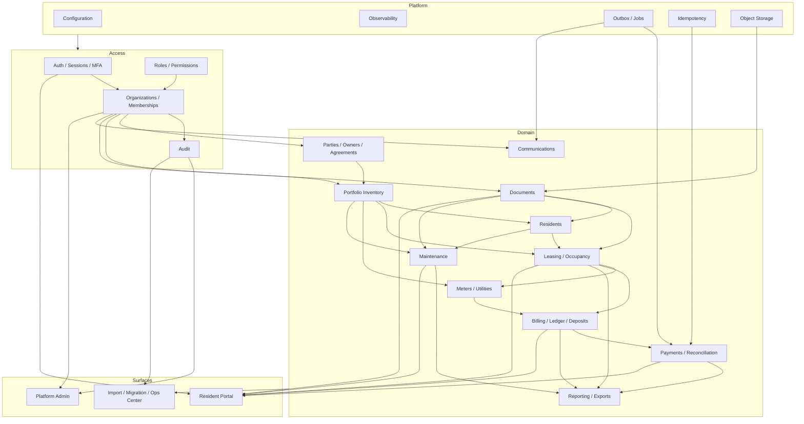
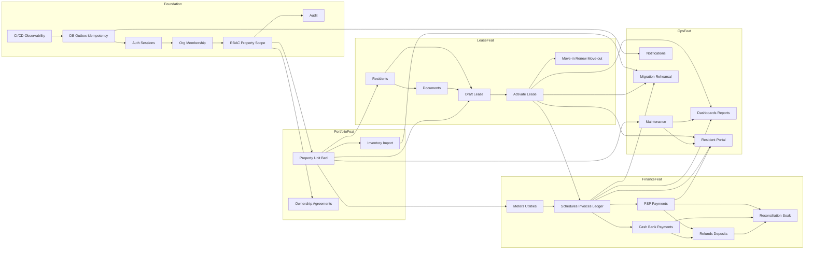
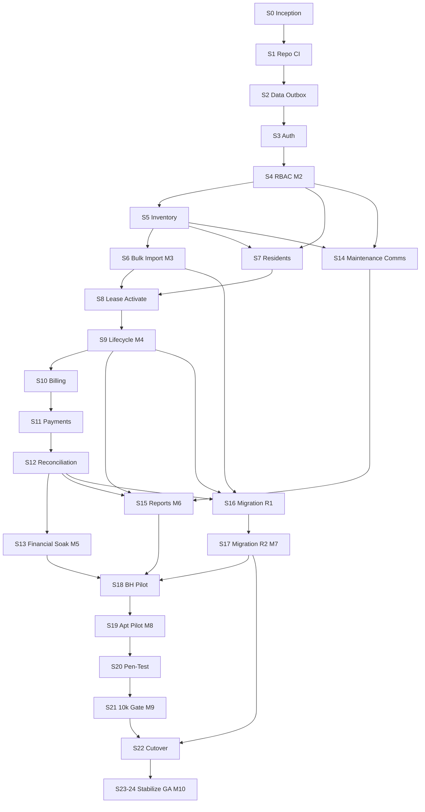
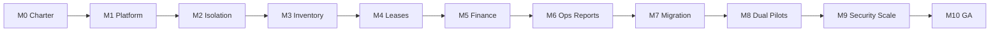
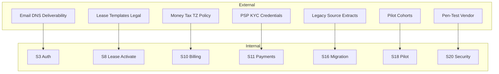
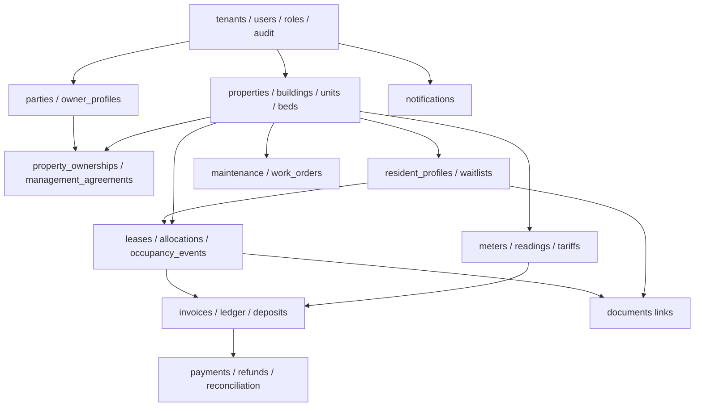
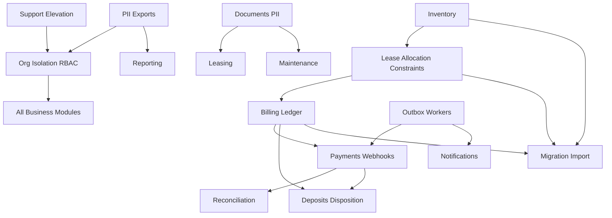

# Dependency Map

**Document ID:** RPM-DEPENDENCY-MAP  
**Status:** Canonical delivery dependency map  
**Audience:** Engineering leads, technical project managers, architects, product owners  
**Normative sources:** [project-roadmap.md](./project-roadmap.md) · [10-development-roadmap.md](./10-development-roadmap.md) · [02-system-architecture.md](./02-system-architecture.md) · [03-database-design.md](./03-database-design.md) · [04-api-specification.md](./04-api-specification.md) · [06-permission-system.md](./06-permission-system.md) · [08-folder-structure.md](./08-folder-structure.md) · [11-design-review-findings.md](./11-design-review-findings.md)

This document maps **what depends on what** across modules, features, and delivery increments. It does not redesign the system. Sprint identifiers refer to the two-week increments defined in [10-development-roadmap.md](./10-development-roadmap.md) (Sprint 0–24). Program phases and milestones refer to [project-roadmap.md](./project-roadmap.md).

---

## 1. Module Dependency Graph

Modules follow the modular-monolith domain boundaries. Lower layers have no upward domain dependencies. Cross-cutting platform services are used by all business modules.

### 1.1 Layered module stack

| Layer | Modules | Depends on |
|---|---|---|
| **Platform** | Configuration, Health, Observability, Outbox/Jobs, Idempotency, Object Storage adapters | Managed infra only |
| **Identity & Access** | Auth, Sessions, MFA, Users, Memberships, Roles/Permissions, Invitations, Audit | Platform |
| **Tenancy** | Organizations (`tenants`), Settings, Subscriptions/Entitlements, Property-scope grants | Identity & Access, Platform |
| **Parties** | Parties, Contacts, Owner Profiles, Property Ownerships, Management Agreements | Tenancy, Audit |
| **Portfolio** | Properties, Buildings/Floors, Units, Beds, Amenities, Inventory status, Rate plans | Tenancy, Parties (ownership attribution) |
| **Documents** | Documents, Versions, Links, Upload/scan pipeline | Tenancy, Object Storage, Audit |
| **Residents** | Resident profiles, Identifiers, Waitlist, Do-not-rent flags | Tenancy, Parties, Documents |
| **Leasing** | Leases, Terms, Parties, Allocations, Occupancy events, Asset/keys | Portfolio, Residents, Documents, Audit |
| **Utilities** | Meters, Readings, Tariffs, Utility allocation runs | Portfolio, Leasing (assignment context) |
| **Billing** | Schedules, Charge rules, Late-fee policies, Invoices, Credit notes, Ledger, Opening balances, Deposits | Leasing, Utilities (optional), Tenancy money policy |
| **Payments** | Payment intents/transactions, Allocations, Refunds, Provider webhooks, Reconciliation | Billing, Idempotency, Outbox |
| **Maintenance** | Requests, Work orders, Assignments, Status history | Portfolio, Residents (minimal), Documents |
| **Communications** | Templates, Notifications, Deliveries | Tenancy, Outbox, Email provider |
| **Reporting** | Dashboards, Reports, Export jobs | Read models over Leasing, Billing, Payments, Maintenance |
| **Migration / Ops** | Import jobs, Export jobs, Operations Center, Support elevation | All domains (scoped), Audit |
| **Resident Portal** | Self-service surfaces | Auth (resident), Leasing, Billing, Payments, Maintenance, Documents, Communications (read/self) |
| **Platform Admin** | Org directory, Support access, Feature flags, Platform audit | Identity, Tenancy, Audit |

### 1.2 Mermaid — module dependencies



### 1.3 Hard module rules

1. **No business module may bypass Organization context** established by Identity & Tenancy.
2. **Property Owner / Management Agreement** modules never grant login or RBAC; they only attribute portfolio ownership.
3. **Payments** depends on **Billing** ledger semantics; payments must not invent balances.
4. **Reporting** is read-only over authoritative domain tables/read models; it is not a write path.
5. **Resident Portal** consumes the same domain services with self-scope enforced server-side.

---

## 2. Feature Dependency Graph

Features are product capabilities. An arrow `A → B` means **B requires A**.

### 2.1 Feature dependency table

| Feature | Requires | Enables |
|---|---|---|
| CI/CD + health + telemetry | — | All deployable features |
| Prisma migrations + org-aware repos + outbox | CI/CD | All persistent features |
| Sign-in / session / refresh | Auth schema | Invitations, org admin, all staff UI |
| Invitations + memberships | Sign-in, Organizations | RBAC assignment |
| Deny-by-default RBAC + property scope | Memberships, Permissions catalog | Safe portfolio and finance features |
| Organization switch (token exchange) | Sessions, Memberships | Multi-org operators |
| Audit trail | Auth actor context | Compliance, support elevation evidence |
| Property / Unit / Bed CRUD | Org + RBAC | Availability, leasing, meters |
| Property ownership & management agreements | Parties + Properties | Owner-attributed reporting (not access) |
| Inventory bulk import | Property/Unit/Bed + Operations | Pilot onboarding, migration |
| Resident profiles | Org + RBAC | Leases, maintenance contact, portal |
| Secure documents | Object storage + Residents/Leases | Lease packs, evidence, portal docs |
| Soft holds / reservations / waitlist | Inventory | Contested availability (MVP-thin OK) |
| Draft lease + allocation constraints | Inventory + Residents | Activation |
| Lease activation | Draft lease + GiST/capacity locks | Occupancy, billing schedules |
| Move-in / renew / move-out | Active lease | Deposit disposition boundary, events |
| Charge schedules + invoices + ledger | Active lease + money policy ADRs | Payments, aging, reports |
| Meter readings + utility allocation | Inventory + active occupancy | Utility charges on invoices |
| Online payments (PSP) | Invoices/ledger + PSP credentials | Receipts, portal pay |
| Cash / bank payment recording | Ledger + SoD permissions | Offline collection |
| Refunds / deposit disposition | Payments + dual-control policy | Financial corrections |
| Reconciliation | Payment transactions + settlements | M5 soak, GA finance gate |
| Maintenance requests / work orders | Portfolio (+ minimal resident) | Ops Phase 6 |
| Notification templates / delivery | Outbox + email | Invitations, billing reminders, maint updates |
| Dashboards / MVP reports / exports | Domain data + export auth | Operator decisioning |
| Resident portal | Auth resident + lease/finance/maint read APIs | Self-service |
| Support elevation | Platform admin + audit + SoD | Safe customer support |
| Migration dry-run / cutover | Import + inventory + lease + opening balances | Pilot/GA data load |
| Financial soak / replay | Billing + payments + reconciliation | M5 / GA |
| Pen-test + 10k load | Full MVP surface | M9 / GA |

### 2.2 Mermaid — feature dependencies



### 2.3 Feature anti-dependencies (must not couple)

| Forbidden coupling | Reason |
|---|---|
| Property Owner → application login | Ownership ≠ access |
| Client-selected `X-Tenant-ID` → authorization | Confused deputy |
| Reporting writes → ledger | Reports are non-authoritative |
| Offline blind replay → payments / lease terminate / role changes | Financial and security integrity |
| Card PAN storage → Payments module | PSP only |

---

## 3. Sprint Dependency Graph

Sprints are the two-week increments in [10-development-roadmap.md](./10-development-roadmap.md). Each sprint **builds on prior exits**; unfinished prior work blocks dependents.

### 3.1 Sprint → sprint dependencies

| Sprint | Name | Hard depends on | Soft / external depends on | Unlocks |
|---|---|---|---|---|
| **0** | Inception | — | SME access, provider shortlist | All later decisions |
| **1** | Repo & delivery | Sprint 0 (M0 intent) | Cloud accounts | Sprint 2 |
| **2** | Data & ops foundation | Sprint 1 | Managed Postgres/Redis/S3 | Sprint 3+ |
| **3** | Auth & invitations | Sprint 2 | Email SPF/DKIM/DMARC | Sprint 4 |
| **4** | RBAC & org admin | Sprint 3 | Approved permission matrix | Sprint 5+ (**M2**) |
| **5** | Property & unit inventory | Sprint 4 | Pilot sample data | Sprint 6–7 |
| **6** | Bulk inventory & scale baseline | Sprint 5 | Mapping rules | Sprint 7+ (**M3**) |
| **7** | Resident management | Sprint 4, Sprint 5 | Privacy/retention decisions | Sprint 8 |
| **8** | Lease create & activate | Sprint 6, Sprint 7 | Money/TZ policy draft; lease templates | Sprint 9 |
| **9** | Lease lifecycle | Sprint 8 | Legal move-out rules | Sprint 10+ (**M4**) |
| **10** | Billing foundation | Sprint 9 | Final money/tax/numbering ADRs | Sprint 11 |
| **11** | Payments & receipts | Sprint 10 | **PSP sandbox + KYC progress** | Sprint 12 |
| **12** | Reconciliation & controls | Sprint 11 | Settlement feeds | Sprint 13 (**M5** entry) |
| **13** | Financial soak & replay | Sprint 12 | Production-shaped volumes | Sprint 14+ (**M5**) |
| **14** | Maintenance & communications | Sprint 4, Sprint 5 | Email deliverability | Sprint 15 |
| **15** | Dashboards & reports | Sprint 9, Sprint 12, Sprint 14 | Metric glossary owners | Sprint 16+ (**M6**) |
| **16** | Migration rehearsal 1 | Sprint 6, Sprint 9, Sprint 12 | Full source extracts | Sprint 17 |
| **17** | Migration rehearsal 2 | Sprint 16 | Fixed defects from R1 | Sprint 18 (**M7**) |
| **18** | Boarding-house pilot | Sprint 13, Sprint 15, Sprint 17 | Contracted BH cohort | Sprint 19 |
| **19** | Apartment-portfolio pilot | Sprint 18 | Contracted apartment cohort | Sprint 20 (**M8**) |
| **20** | Security hardening & pen-test | Sprint 19 | Pen-test vendor window | Sprint 21 |
| **21** | Remediation & 10k gate | Sprint 20 | Load environment capacity | Sprint 22 (**M9**) |
| **22** | Production cutover | Sprint 17, Sprint 21 | Freeze window, backups | Sprint 23 |
| **23–24** | Stabilization & GA | Sprint 22 | On-call coverage | **M10 / GA** |

### 3.2 Mermaid — sprint dependency graph



### 3.3 Parallelism (safe concurrent tracks)

These may proceed in parallel **after** their listed prerequisites, without creating hidden coupling:

| Track A | Track B | Shared prerequisite |
|---|---|---|
| Inventory UI polish (S5–S6) | Auth abuse / isolation hardening (S4+) | S4 |
| Resident documents (S7) | Lease template legal review | S5 |
| Maintenance (S14) | Financial soak prep (S13) | S4 + domain data |
| Notification templates (S14) | Report glossary definition | S2 outbox |
| Pen-test scheduling | Pilot operations (S18–S19) | Vendor booked by S8 |

Do **not** parallelize: Payments before Billing foundation; Activation before allocation constraints; Cutover before M7 and M9; GA before soak + dual pilots.

---

## 4. Mermaid Diagrams (program views)

### 4.1 Phase / milestone critical spine



### 4.2 External dependency swimlane



### 4.3 Data-domain dependency (persistence order)



---

## 5. Critical Path

The **critical path** is the longest dependency chain that determines earliest GA. Slip on any node slips M10 unless scope is explicitly cut.

### 5.1 Critical path sequence

```text
M0 decisions (roles, money/TZ, PSP kickoff, country freeze)
  → Platform CI/CD + DB/outbox (S1–S2 / M1)
  → Auth + Org + RBAC isolation (S3–S4 / M2)
  → Inventory + import (S5–S6 / M3)
  → Residents + lease activate + lifecycle (S7–S9 / M4)
  → Billing foundation (S10)
  → Payments + PSP credentials (S11)     ← external KYC often on critical path
  → Reconciliation (S12)
  → Financial soak/replay (S13 / M5)
  → Ops + reports (S14–S15 / M6)         ← can partially overlap soak prep
  → Migration rehearsal ×2 (S16–S17 / M7)
  → Dual pilots (S18–S19 / M8)
  → Pen-test + remediation + 10k load (S20–S21 / M9)
  → Cutover + stabilization + live billing cycle (S22–S24 / M10)
```

### 5.2 Mermaid — critical path

```mermaid
flowchart LR
  CP0[M0 Decisions + PSP Start] --> CP1[M1 Platform]
  CP1 --> CP2[M2 Isolation]
  CP2 --> CP3[M3 Inventory]
  CP3 --> CP4[M4 Lease Lifecycle]
  CP4 --> CP5a[Billing]
  CP5a --> CP5b[Payments + KYC]
  CP5b --> CP5c[Recon + Soak M5]
  CP5c --> CP6[M6 Ops Reports]
  CP6 --> CP7[M7 Migrations x2]
  CP7 --> CP8[M8 Dual Pilots]
  CP8 --> CP9[M9 Pen-Test + 10k]
  CP9 --> CP10[M10 GA]
```



### 5.3 Critical path floats (near-critical)

| Item | Float vs critical path | Notes |
|---|---|---|
| Maintenance + notifications (S14) | Small | Must finish before M6; can overlap S13 |
| Ownership/management-agreement UI | Medium | Needed for operator model honesty; not on payment path |
| Resident portal MVP | Medium | Can trail staff finance slightly; needed before full pilot UX |
| Platform support elevation | Medium | Required before production support; before S18 ideal |
| Utility allocation depth | Medium–High | Boarding-house pilot may pull it onto critical path |

### 5.4 Single points of schedule failure

1. **PSP production credentials** not ready by S11–S12.
2. **Money/tax/timezone ADR** undecided before S10.
3. **GiST exclusion / capacity locking** defects discovered late in S8–S9.
4. **Source data quality** blocking S16–S17 rehearsals.
5. **Pen-test window** unavailable in S20–S21.
6. **Pilot cohorts** not contracted by S18.

---

## 6. High Risk Modules

Risk combines **blast radius**, **correctness difficulty**, and **launch-gate coupling**. Owners should be named seniors; changes require heightened review, isolation tests, and runbook updates.

| Rank | Module / subsystem | Why high risk | Depends on | Failure mode | Required controls |
|---|---|---|---|---|---|
| **1** | **Organization isolation & RBAC** | Any leak is launch-blocking; confused-deputy history | Auth, memberships, property grants | Cross-org data exposure | Deny-by-default; negative isolation suite on every endpoint/repo/job; ban tenant headers |
| **2** | **Payments + provider webhooks** | Money movement; duplicate/replay hazard; KYC external | Billing ledger, idempotency, outbox | Double charge, lost payment, stuck intent | HMAC verify, idempotent consumers, DLQ, sandbox chaos, soak |
| **3** | **Billing runs & ledger** | Month-start concurrency; rounding/TZ; duplicate charges | Lease terms, schedules, advisory locks | Wrong invoices at scale | Deterministic runs, preview/approval, `NUMERIC(19,4)`, replay runbooks |
| **4** | **Lease allocation / occupancy** | Double-booking destroys trust | Units/Beds, GiST EXCLUDE, capacity locks | Overlap occupancy | Raw SQL constraints + concurrency tests |
| **5** | **Reconciliation** | GA finance gate; exception queues | Payments, settlements | Unexplained imbalance | Daily recon, unmatched item workflow, dual control |
| **6** | **Security deposits & disposition** | Legal variance; dual-control | Leases, ledger, approvals | Improper release/forfeit | Checklist UX, SoD, audit, country freeze |
| **7** | **Migration / import** | Pilot success dominated by data quality | Inventory, leases, opening balances | Corrupt cutover | Dry-run, reject CSV, two rehearsals, checksums |
| **8** | **Documents / object storage** | PII and malware; signed URL abuse | S3, authz, virus scan | Data leak or quarantine backlog | Org-scoped keys, short-lived URLs, scan states |
| **9** | **Utility allocation** | Disputes; explainability over formulas | Meters, occupancy, invoices | Contested charges | Preview, evidence, versioned rules |
| **10** | **Support elevation** | Privileged access abuse | Platform admin, audit, SoD | Silent impersonation | Banner, time-bound, dual identity audit, banned actions |
| **11** | **Outbox / workers / Redis** | Durability misconceptions | Postgres outbox as SoT | Lost domain events if Redis trusted as SoT | Outbox-first; Redis loss must not lose committed work |
| **12** | **Exports / PII reports** | Bulk data exfiltration | Reporting, step-up auth | Privacy incident | Purpose capture, rate limits, approval, expiry |

### 6.1 Mermaid — high-risk module cluster



### 6.2 Review bar for high-risk changes

For modules ranked 1–7:

- Architecture or senior engineer review required.
- Organization-isolation and financial/concurrency tests updated in the same change.
- Runbooks updated when billing, payment, reconciliation, or migration behavior changes.
- Feature flag for first production exposure where feasible.
- No merge if isolation or soak-related CI gates fail.

---

## 7. Traceability summary

| Question | See |
|---|---|
| What phase/milestone am I in? | [project-roadmap.md](./project-roadmap.md) |
| What happens in Sprint N? | [10-development-roadmap.md](./10-development-roadmap.md) |
| Which tables land when? | [03-database-design.md](./03-database-design.md) + this map §4.3 |
| Which API family unlocks which feature? | [04-api-specification.md](./04-api-specification.md) + this map §2 |
| Which permissions gate a feature? | [06-permission-system.md](./06-permission-system.md) |
| What residual risks remain? | [11-design-review-findings.md](./11-design-review-findings.md) |

---

## 8. Dependency change control

1. Adding a dependency that crosses module layers requires an ADR or explicit roadmap amendment.
2. Pulling a deferred feature (SSO, payment plans, owner payouts, two-way messaging) onto the critical path requires removing equal scope and re-baselining M5–M10.
3. External dependency slips (PSP, pen-test, pilots, source data) are tracked with owner, required-by date, confidence, and fallback—never as silent schedule optimism.
