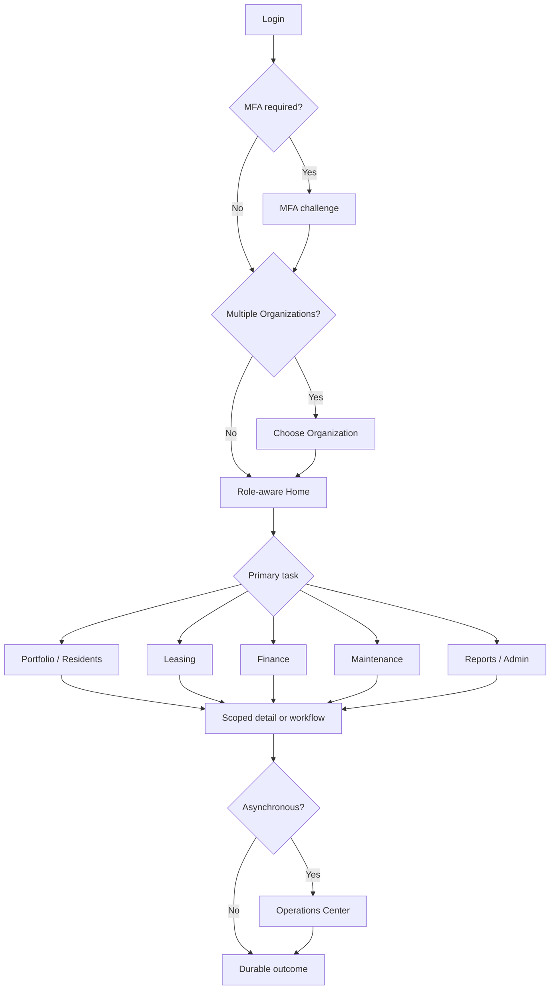
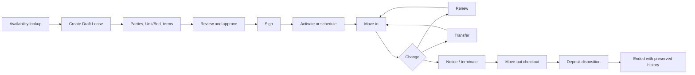
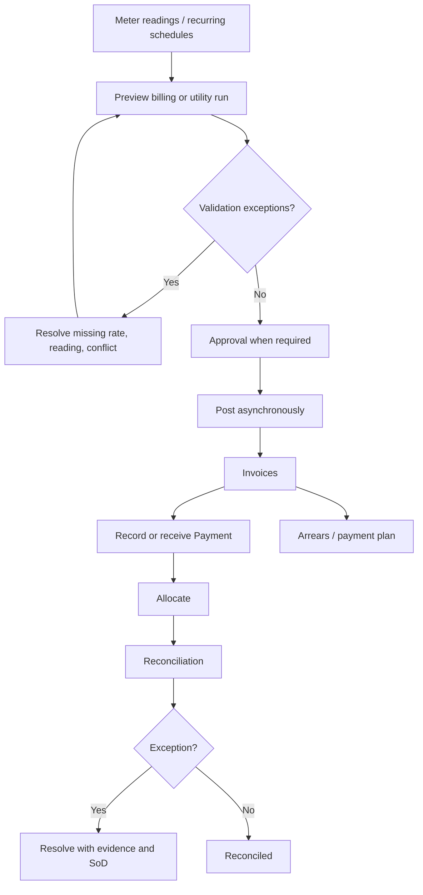
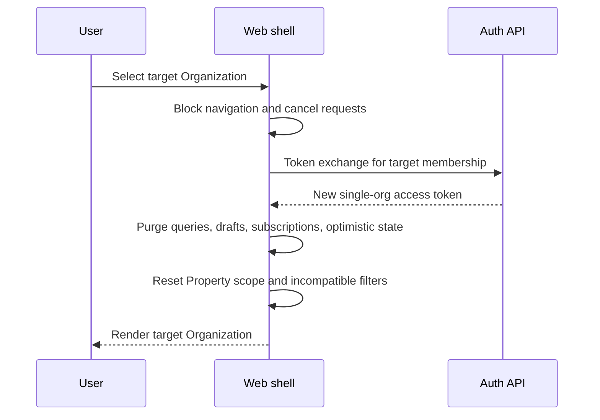

# Navigation and User Flows

**Status:** Canonical information architecture  
**References:** [UI Design](./07-ui-design.md) · [Permission System](./06-permission-system.md) · [UI Documentation Index](./ui/README.md) · [Cross-Cutting Patterns](./ui/cross-cutting-patterns.md) · [Deferred Screens](./ui/deferred-screens.md)

## Navigation principles

The staff shell is Organization-centric: active Organization → authorized Property scope → domain → list/workspace → detail/workflow. Navigation is permission-aware but server authorization is authoritative. The active Organization, Property scope, read-only state, support-access state, as-of/freshness, and currency/time-zone context remain visible wherever they affect interpretation.

Organization is the SaaS boundary. A renter is a Resident, a contract is a Lease, and an apartment/private room/shared room is a Unit; optional Beds sit beneath a shared Unit. Property Owner is a business Party and is distinct from Organization Owner.

## Complete navigation tree

### Public/authentication
- Login
- Forgot password → Reset password
- Email verification
- MFA challenge
- Invitation acceptance

### Staff shell
- **Home**
  - Role-aware dashboard
- **Portfolio**
  - Properties → Property detail → Buildings / Units / Property Owners / Management Agreements
  - Units → Unit detail → optional Beds
  - Availability lookup
- **Residents**
  - Residents → Resident detail
  - Waitlist
- **Leasing**
  - Leases → Lease detail
  - Create Lease → approval/signature → activate → move-in
  - Renew or transfer
  - Move-out checkout
- **Finance**
  - Invoices and Credit Notes
  - Billing run
  - Meters and utility allocation
  - Payments, payment plans, deposits
  - Arrears, expenses, reconciliation
- **Maintenance**
  - Requests → request detail
  - Work Orders → work-order detail
  - Inspections → inspection detail
- **Communications**
  - Notifications → compose/detail
  - Notification templates → editor
- **Documents**
  - Library → upload/detail
- **Reports**
  - Catalog → report run
  - Scheduled reports → editor
- **Administration**
  - Organization settings
  - Users, invitations, roles
  - Integrations
  - Audit log
  - Import wizard / Export center
- **Shell utilities**
  - Organization switcher, Property scope, global search, notifications, Operations Center, help, profile/security

### Resident portal
- Home
- My Lease
- Invoices
- Payments
- Maintenance
- Documents
- Profile and security

### Platform shell
- Platform dashboard
- Organizations
- Support access

## Route inventory
- **Auth**
  - [Login](ui/auth/login.md)
  - [Forgot Password](ui/auth/forgot-password.md)
  - [Reset Password](ui/auth/reset-password.md)
  - [Email Verify](ui/auth/email-verify.md)
  - [MFA Challenge](ui/auth/mfa-challenge.md)
  - [Invitation Accept](ui/auth/invitation-accept.md)
- **Shell**
  - [Organization Switcher](ui/shell/organization-switcher.md)
  - [Global Search](ui/shell/global-search.md)
  - [Notifications Center](ui/shell/notifications-center.md)
  - [Operations Center](ui/shell/operations-center.md)
- **Home**
  - [Dashboard Home](ui/home/dashboard-home.md)
- **Portfolio**
  - [Properties List](ui/portfolio/properties-list.md)
  - [Property Detail](ui/portfolio/property-detail.md)
  - [Property Create Edit](ui/portfolio/property-create-edit.md)
  - [Buildings List](ui/portfolio/buildings-list.md)
  - [Units List](ui/portfolio/units-list.md)
  - [Unit Detail](ui/portfolio/unit-detail.md)
  - [Unit Create Edit](ui/portfolio/unit-create-edit.md)
  - [Beds List](ui/portfolio/beds-list.md)
  - [Availability Lookup](ui/portfolio/availability-lookup.md)
  - [Property Owners List](ui/portfolio/property-owners-list.md)
  - [Property Owner Detail](ui/portfolio/property-owner-detail.md)
  - [Management Agreements List](ui/portfolio/management-agreements-list.md)
  - [Management Agreement Detail](ui/portfolio/management-agreement-detail.md)
- **Residents**
  - [Residents List](ui/residents/residents-list.md)
  - [Resident Detail](ui/residents/resident-detail.md)
  - [Resident Create Edit](ui/residents/resident-create-edit.md)
  - [Waitlist](ui/residents/waitlist.md)
- **Leasing**
  - [Leases List](ui/leasing/leases-list.md)
  - [Lease Detail](ui/leasing/lease-detail.md)
  - [Lease Create Wizard](ui/leasing/lease-create-wizard.md)
  - [Lease Activate](ui/leasing/lease-activate.md)
  - [Lease Renew Transfer](ui/leasing/lease-renew-transfer.md)
  - [Move In](ui/leasing/move-in.md)
  - [Move Out Checkout](ui/leasing/move-out-checkout.md)
- **Finance**
  - [Invoices List](ui/finance/invoices-list.md)
  - [Invoice Detail](ui/finance/invoice-detail.md)
  - [Billing Run Workspace](ui/finance/billing-run-workspace.md)
  - [Meter Reading Grid](ui/finance/meter-reading-grid.md)
  - [Utility Allocation Run](ui/finance/utility-allocation-run.md)
  - [Payment Record Cash Bank](ui/finance/payment-record-cash-bank.md)
  - [Payments List](ui/finance/payments-list.md)
  - [Payment Detail](ui/finance/payment-detail.md)
  - [Payment Plans List](ui/finance/payment-plans-list.md)
  - [Payment Plan Detail](ui/finance/payment-plan-detail.md)
  - [Deposits List](ui/finance/deposits-list.md)
  - [Deposit Disposition](ui/finance/deposit-disposition.md)
  - [Arrears Workspace](ui/finance/arrears-workspace.md)
  - [Expenses List](ui/finance/expenses-list.md)
  - [Expense Detail](ui/finance/expense-detail.md)
  - [Reconciliation Workspace](ui/finance/reconciliation-workspace.md)
  - [Credit Notes List](ui/finance/credit-notes-list.md)
- **Maintenance**
  - [Maintenance Requests List](ui/maintenance/maintenance-requests-list.md)
  - [Maintenance Request Detail](ui/maintenance/maintenance-request-detail.md)
  - [Work Orders List](ui/maintenance/work-orders-list.md)
  - [Work Order Detail](ui/maintenance/work-order-detail.md)
  - [Inspections List](ui/maintenance/inspections-list.md)
  - [Inspection Detail](ui/maintenance/inspection-detail.md)
- **Communications**
  - [Notifications List](ui/communications/notifications-list.md)
  - [Notification Compose](ui/communications/notification-compose.md)
  - [Notification Templates List](ui/communications/notification-templates-list.md)
  - [Notification Template Editor](ui/communications/notification-template-editor.md)
- **Documents**
  - [Documents Library](ui/documents/documents-library.md)
  - [Document Upload](ui/documents/document-upload.md)
  - [Document Detail](ui/documents/document-detail.md)
- **Reports**
  - [Reports Catalog](ui/reports/reports-catalog.md)
  - [Report Run](ui/reports/report-run.md)
  - [Scheduled Reports List](ui/reports/scheduled-reports-list.md)
  - [Scheduled Report Editor](ui/reports/scheduled-report-editor.md)
- **Admin**
  - [Organization Settings](ui/admin/organization-settings.md)
  - [Users List](ui/admin/users-list.md)
  - [User Detail](ui/admin/user-detail.md)
  - [Invitations List](ui/admin/invitations-list.md)
  - [Roles List](ui/admin/roles-list.md)
  - [Role Editor](ui/admin/role-editor.md)
  - [Integrations List](ui/admin/integrations-list.md)
  - [Integration Detail](ui/admin/integration-detail.md)
  - [Audit Log](ui/admin/audit-log.md)
  - [Import Wizard](ui/admin/import-wizard.md)
  - [Export Center](ui/admin/export-center.md)
- **Resident Portal**
  - [Portal Home](ui/resident-portal/portal-home.md)
  - [Portal Lease](ui/resident-portal/portal-lease.md)
  - [Portal Invoices](ui/resident-portal/portal-invoices.md)
  - [Portal Payments](ui/resident-portal/portal-payments.md)
  - [Portal Maintenance](ui/resident-portal/portal-maintenance.md)
  - [Portal Documents](ui/resident-portal/portal-documents.md)
  - [Portal Profile](ui/resident-portal/portal-profile.md)
- **Platform**
  - [Platform Dashboard](ui/platform/platform-dashboard.md)
  - [Platform Organizations](ui/platform/platform-organizations.md)
  - [Support Access](ui/platform/support-access.md)

## Primary staff journey

## Lease lifecycle journey

## Finance and operations journey

## Organization switch safety

## Mobile navigation

Staff: Home, Tasks/Operations, Search, Notifications, More. Resident: Home, Payments, Maintenance, Documents, More. Organization and Property context are reachable in one interaction. Desktop-recommended dense workspaces remain inspectable on mobile, but high-risk submissions require a confirmed online state.

## Deferred navigation (backlog)

The following destinations are planned in product and architecture documentation but do not yet have dedicated screen specifications. See [deferred-screens.md](./ui/deferred-screens.md) for promotion criteria and interim coverage.

- Administration → **Approvals** (dual-control inbox)
- Administration → **Security** (MFA policy, SSO, session policy)
- Administration → **Billing** (SaaS subscription to platform vendor)
- Finance → **Charges**, **Refunds**, **Write-offs**, **Late fees**
- Portfolio → **Holds**, **Reservations**, **Assets/keys**
- Leasing → **Applications**
- Residents → **Screening workspace**
- Communications → **Conversations** (two-way messaging)
- Resident portal → **Notices** (dedicated inbox)
- Maintenance → **Vendors**
- Platform → **Security alerts**, **Audit**, **Feature flags**, **Usage**
