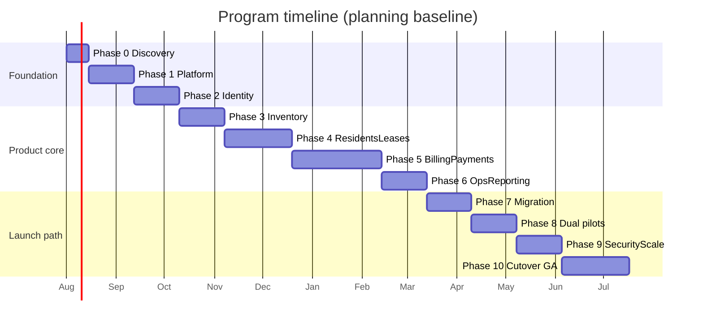

# Project Roadmap

**Document ID:** RPM-ROADMAP-PROJECT  
**Status:** Canonical program roadmap  
**Audience:** Product, engineering, design, operations, finance, security, implementation, and executive stakeholders  
**Normative sources:** [00 — Overview](./00-overview.md) · [01 — Business Requirements](./01-business-requirements.md) · [02 — System Architecture](./02-system-architecture.md) · [10 — Development Roadmap](./10-development-roadmap.md) · [11 — Design Review Findings](./11-design-review-findings.md)

This document is the program-level roadmap for delivering the Rental Property Management SaaS from foundation through general availability (GA) and post-GA expansion. It does not redesign architecture, APIs, data model, or UX. Detailed engineering sequencing remains in [10-development-roadmap.md](./10-development-roadmap.md). Screen and design delivery remain governed by [navigation.md](./navigation.md), [design-system.md](./design-system.md), and [ui/README.md](./ui/README.md).

---

## 1. Project Phases

Baseline assumptions: two-week engineering increments; one cross-functional product team (~8–10 FTE plus part-time specialists); one primary country, currency, language, tax context, and payment provider for MVP; modular monolith (React/TypeScript, NestJS, PostgreSQL/Prisma, Redis, S3-compatible storage).

| Phase | Name | Intent | Outcome |
|---|---|---|---|
| **Phase 0** | Discovery and delivery setup | Freeze MVP boundaries, domain language, ADRs, threat model, provider choices, and permission matrix | Program can start engineering without unresolved launch-blocking product decisions |
| **Phase 1** | Platform foundation | Monorepo, CI/CD, configuration, health/telemetry, Prisma/migration workflow, Redis/outbox, staging | Empty production-shaped vertical slice deploys automatically |
| **Phase 2** | Identity and Organization boundary | Auth, sessions, invitations, memberships, deny-by-default RBAC, org switch, audit | Multi-Organization isolation and authorization suite passes |
| **Phase 3** | Property inventory | Property → Unit → optional Bed, amenities, status, bulk import/export, ownership attribution | Pilot portfolios can be imported, validated, searched, and exported |
| **Phase 4** | Residents and leases | Resident profiles, documents, lease create/activate, move-in/renew/move-out, occupancy integrity | End-to-end leasing lifecycle accepted by pilot operators |
| **Phase 5** | Billing and payments | Charge schedules, invoices/ledger, meters/utilities (MVP), PSP + cash/bank, receipts, reconciliation, financial soak | Parallel financial run reconciles within agreed tolerances |
| **Phase 6** | Operations and reporting | Maintenance, notifications, dashboards, MVP reports/exports, Operations Center | Daily operational workflows accepted by pilot users |
| **Phase 7** | Migration rehearsals | Two timed rehearsals for boarding-house and apartment source shapes | Count, financial, duration, exception, and rollback criteria met |
| **Phase 8** | Representative pilots | One boarding-house and one apartment portfolio in controlled production | Both cohorts satisfy product, finance, support, and operational exit criteria |
| **Phase 9** | Security and scale launch gate | Hardening, independent pen-test, remediation, WCAG 2.2 AA, 10,000-unit load | No unresolved launch-blocking security finding; scale gate passes |
| **Phase 10** | Launch and stabilization | Production cutover, staged rollout, intensive monitoring, first live billing/payment/recon cycle | GA decision and stabilization review completed |

### Phase boundaries (non-negotiable)

1. Organization isolation, audit, observability, and delivery automation precede multiplying business modules.
2. Billing and payment foundations start early enough to absorb provider KYC and reconciliation risk.
3. Migrations are backward-compatible; releases are reversible within the approved window.
4. GA is not declared before financial soak, two migration rehearsals, dual pilots, independent pen-test, and the 10,000-unit load gate.

---

## 2. Milestones

| ID | Milestone | Phase | Acceptance summary |
|---|---|---|---|
| **M0** | MVP charter and architecture baseline approved | 0 | Personas, vocabulary, permission matrix, ADRs, threat model, NFR targets, provider selections, and migration assessment approved |
| **M1** | Production-shaped empty vertical slice deploys | 1 | Web → API traced request deploys via CI to development and staging; restore rehearsal succeeds in non-production |
| **M2** | Organization isolation and authorization suite passes | 2 | Deny-by-default RBAC, org-scoped JWT, negative isolation tests, invitation/admin flows, and audit foundations approved |
| **M3** | Pilot inventory importable and operable | 3 | Property/Unit/Bed inventory imported with validation, search, pagination, export, and agreed error handling |
| **M4** | Lease lifecycle accepted end to end | 4 | Move-in, renewal, and move-out scenarios pass with occupancy constraints and document rules |
| **M5** | Financial parallel run reconciles | 5 | No unexplained duplicate, missing, or imbalanced transaction; webhook replay and soak criteria met |
| **M6** | Core operations and reports accepted | 6 | Maintenance, notifications, dashboards, and MVP reports signed off by named business owners |
| **M7** | Migration rehearsals meet tolerances | 7 | Two full timed rehearsals meet count, financial, duration, exception, and rollback criteria for both source shapes |
| **M8** | Dual pilots satisfy exit criteria | 8 | Boarding-house and apartment cohorts complete representative billing, payment, reconciliation, maintenance, and move-out cycles |
| **M9** | Security and scale gates cleared | 9 | No unresolved critical/high exploitable finding; 10,000-unit workload and backlog-recovery targets pass; WCAG 2.2 AA for critical workflows |
| **M10** | General availability decision | 10 | Production cutover stable; ≥1 live billing/payment/reconciliation cycle observed; GA approved or controlled rollout extended with explicit reason |

Milestones are accepted only when demonstrated in the target environment, automated acceptance and Organization-isolation tests pass, named owners approve, and known limitations are recorded with owners and dates.

---

## 3. Timeline

| Window | Calendar (planning baseline) | Phases | Primary milestones |
|---|---|---|---|
| **Months 0–0.5** | Inception (~2 weeks) | Phase 0 | M0 |
| **Months 0.5–1.5** | ~4 weeks | Phase 1 | M1 |
| **Months 1.5–2.5** | ~4 weeks | Phase 2 | M2 |
| **Months 2.5–3.5** | ~4 weeks | Phase 3 | M3 |
| **Months 3.5–5** | ~6 weeks | Phase 4 | M4 |
| **Months 5–7** | ~8 weeks | Phase 5 | M5 |
| **Months 7–8** | ~4 weeks | Phase 6 | M6 |
| **Months 8–9** | ~4 weeks | Phase 7 | M7 |
| **Months 9–10** | ~4 weeks | Phase 8 | M8 |
| **Months 10–11** | ~4 weeks | Phase 9 | M9 |
| **Months 11–12** | ~6 weeks | Phase 10 | M10 / GA |

**Planning envelope**

- Controlled pilots: plausible after approximately **18** two-week increments (~9 months).
- General availability: not planned before approximately **24** two-week increments (~12 months), subject to discovery, KYC, staffing, legal variance, and data quality.

**External timeline drivers (start in Phase 0)**

| Driver | Needed by | Typical lead time |
|---|---|---|
| Payment-provider KYC, underwriting, bank verification, production credentials | Phase 5 | 6–12+ weeks |
| Email SPF/DKIM/DMARC | Phase 2 | Days–weeks |
| Lease templates and legal workflow | Phase 4 | Weeks |
| Monetary / tax / timezone / numbering policy | Phase 5 | Decision deadline before billing build |
| Pen-test vendor reservation | Phase 9 (book by Phase 4) | Vendor scheduling |
| Two pilot cohorts contracted | Phase 8 | Discovery → Phase 3 |

Timeline progress is reported by **accepted milestones**, not percentage-complete estimates.

---

## 4. Deliverables

### 4.1 Phase deliverables

| Phase | Engineering / product deliverables | Operational deliverables |
|---|---|---|
| **0** | Approved MVP charter, ADRs, threat model, permission matrix, backlog, provider selections | Risk register, success metrics, migration assessment, pilot outreach plan |
| **1** | Monorepo, CI quality gates, health/telemetry, Prisma/migration baseline, Redis/outbox skeleton, staging deploy | Incident, deploy, restore, and migration runbook skeletons |
| **2** | Auth/session/MFA challenge, invitations, Organizations, memberships, roles, org switch, audit events, admin UI | Email deliverability baseline; isolation test suite as release gate |
| **3** | Properties, buildings, Units, Beds, amenities, ownership/management-agreement records, inventory import wizard | Pilot inventory mapping and cleansing rules |
| **4** | Residents, documents, lease wizard/activate, move-in/renew/move-out, occupancy exclusion constraints | Lease template process; lifecycle acceptance scripts |
| **5** | Billing schedules, invoices/ledger, meter/utility MVP, PSP + offline payments, receipts, reconciliation, soak evidence | Daily recon and payment-incident runbooks; finance sign-off package |
| **6** | Maintenance requests/work orders, notification templates/delivery, dashboards, MVP reports/exports, Operations Center | Reporting glossary; support triage playbooks |
| **7** | Idempotent migration tooling, dry-run/reject CSVs, opening-balance reconciliation, rollback rehearsal evidence | Cutover checklist; freeze/read-only communications draft |
| **8** | Feature-flagged pilot cohorts; defect triage backlog; support-access readiness | Daily pilot reviews; training materials; escalation paths |
| **9** | Hardening fixes, pen-test remediations, load-test evidence, capacity alerts, a11y evidence | Signed security disposition; scaling thresholds; residual risk register |
| **10** | Production migration, staged enablement, stabilization patches | On-call coverage; GA decision record; post-launch review |

### 4.2 Cross-cutting deliverables (every phase)

- Backward-compatible (or approved) database migrations with Organization-aware repository filters.
- Server-enforced authorization and negative Organization-isolation tests for new capabilities.
- Audit events for security- and finance-relevant mutations.
- Observability: structured logs, metrics, traces, and alerts proportionate to risk.
- Documentation updates for API, permissions, UI, and runbooks affected by the phase.
- Feature flags for risky capabilities where partial enablement or rollback is required.

### 4.3 Explicit non-deliverables (MVP / GA)

- Owner distribution / payout calculation and trust-accounting ledgers.
- Full general ledger, payroll, or statutory tax filing engines.
- Enterprise SSO/SCIM.
- Native iOS/Android applications.
- Public marketplace / listing syndication.
- Smart-lock / IoT meter integrations and broad ERP connectors.
- Custom Organization workflow builders and AI automation.
- Microservices extraction.
- Payment plans / promise-to-pay automation, e-signature workflows, and SMS consent management (Post-GA Phase 2).
- Two-way resident messaging and online applications pipeline (deferred).

---

## 5. Risks

| ID | Risk | Impact | Likelihood | Mitigation | Residual |
|---|---|---|---|---|---|
| R1 | Payment-provider KYC / credentials delay | Blocks Phase 5 launch of online payments | High | Start in Phase 0; weekly SLA tracking; sandbox adapter; cash/bank fallback | Schedule slip |
| R2 | Spreadsheet / legacy data quality | Failed migrations, wrong balances, pilot distrust | High | Early samples; dry-run rejects; business-owned cleansing; two rehearsals | Manual exceptions |
| R3 | Financial correctness (rounding, TZ, retries, webhook dupes) | Duplicate/missing charges or payments | Medium–High | ADRs; soak; idempotency; recon runbooks; dual-control on high-risk mutations | Continuous vigilance |
| R4 | Cross-Organization data leakage (API, cache, jobs, exports, object keys) | Launch-blocking security failure | Medium | Deny-by-default; isolation suite; org-switch purge; pen-test | Zero-tolerance residual |
| R5 | Scope expansion (GL, multi-country, SSO, trust accounting) | Slips GA or weakens quality | High | Explicit exclusions; change control; remove equal scope for any add | Sales pressure |
| R6 | Deposit / notice / privacy law variance | Invalid move-out or messaging flows | Medium | Single-country MVP freeze; legal review; country packs post-GA | Jurisdiction debt |
| R7 | Utility allocation disputes | Support load; billing distrust | Medium | Explainability, evidence, preview before commit | Product-hard |
| R8 | 10,000-unit performance shortfall | Fails M9 | Medium | Indexes, pagination, worker fairness, early volume tests from Phase 3 | Capacity cost |
| R9 | Prisma + raw SQL hybrid drift (EXCLUDE, partial indexes) | Production constraint failures | Medium | CI migrate checks; drift detection; senior ownership | Process discipline |
| R10 | Pen-test / vendor window slip | Delays M9/M10 | Medium | Reserve by Phase 4; time-box remediation | Calendar risk |
| R11 | Pilot cohort unavailability | Hidden product-fit risk | Medium | Contract early; synthetic fallback for rehearsal only | Fit uncertainty |
| R12 | Knowledge concentration (billing, tenancy, infra) | Bus factor; fragile launch | Medium | Pairing, runbooks, ownership matrix | Ongoing |
| R13 | Noisy-neighbor / cell placement needs earlier than planned | Ops complexity | Low–Medium | Quotas, fair queues; `deployment_cells` modeled but not early default | Enterprise trigger |
| R14 | Overclaiming owner payouts in sales materials | Contractual and trust risk | Medium | Contractual honesty; attribution-only reporting in MVP | Commercial discipline |

**Non-waivable launch risks:** Organization isolation failure, unexplained financial imbalance, inability to meet RPO/RTO, and unresolved critical/high exploitable security findings.

---

## 6. Future Expansion

Expansion is sequenced after GA unless discovery explicitly trades equal MVP scope.

### 6.1 Post-GA Phase 2 (near-term product)

- Payment plans and promise-to-pay automation.
- E-signature workflows for lease execution.
- SMS delivery with consent management.
- Owner statements and owner-facing operational reporting (still without payout execution unless separately chartered).
- Resident portal depth: dedicated notices inbox, richer self-service.
- Approvals inbox unifying dual-control finance/admin queues.
- Inventory holds/reservations workspaces promoted from deferred UI backlog.
- Security settings depth (MFA policy, session policy) and SaaS subscription billing UX for the platform vendor relationship.

### 6.2 Post-GA Phase 3 (platform and enterprise)

- Enterprise SSO (OIDC first, SAML when required) and SCIM provisioning.
- Multi-country tax/regulatory packs and additional payment methods.
- Advanced arrears automation and collections sequences.
- Vendor directory and richer maintenance cost accounting.
- Analytics warehouse / dedicated search when PostgreSQL search ceilings are proven.
- Deployment-cell isolation for noisy-neighbor enterprise customers.

### 6.3 Explicitly deferred / separate product decisions

- Owner distribution waterfalls, reserve accounting, and disbursement rails.
- Full statutory trust accounting.
- Native mobile applications.
- Marketplace / listing syndication.
- Smart-lock and IoT integrations.
- Custom Organization-defined workflow and report builders.
- AI pricing or automation products.
- Microservices extraction (only when modular-monolith boundaries and scale evidence demand it).

---

## 7. Release Strategy

### 7.1 Environments

| Environment | Purpose | Cadence |
|---|---|---|
| **Local** | Developer feedback; synthetic data | Continuous |
| **Test / CI** | Ephemeral isolated fixtures; PR gates | Every pull request |
| **Development** | Integrated feature validation | Continuous from default branch |
| **Staging** | Production-like topology; UAT, migration rehearsal, load, restore drills | Release candidates |
| **Pilot / Production** | Controlled cohorts via Organization/Property allowlists and feature flags | Milestone-gated |

### 7.2 Release train

1. **Continuous integration** on every change: typecheck, lint, unit/component, isolation tests, SCA/secrets/SAST, Prisma migrate checks, OpenAPI compatibility, build.
2. **Development deploy** on merge to default branch with smoke tests.
3. **Staging promotion** for release candidates with contract, e2e, and migration dry-runs.
4. **Pilot enablement** by feature flag / allowlist—not a permanently divergent fork.
5. **Production cutover** only after M7–M9 gates; staged cohort enablement with go/no-go checkpoints.
6. **Stabilization window** (Phase 10) before GA approval.

### 7.3 Feature flags and progressive delivery

- Risky capabilities (payments, billing runs, exports, support elevation, imports) ship behind flags.
- Flags are Organization- and Property-scoped where needed.
- Flag state is auditable; temporary migration privileges are removed after stabilization.
- Partial rollback prefers disabling a capability over incompatible schema rollback when schema is forward-only.

### 7.4 Rollback and freeze

**Immediate stop / rollback triggers**

- Confirmed cross-Organization exposure or authorization bypass.
- Unexplained financial imbalance, duplicate billing, or payment corruption.
- Migration reconciliation outside approved tolerance.
- Sustained critical-path error or latency above threshold.
- Failure to meet RPO ≤ 15 minutes / RTO ≤ 4 hours.
- Material provider failure without a safe degraded mode.

**Mechanics**

- Prefer backward-compatible schema across the release window.
- Retain source snapshots; define whether legacy systems remain read-only or resume writes.
- Record post-cutover writes and payment events for replay/reconciliation.
- Named rollback decision owner and time limit before every cutover; rollback is rehearsed.

### 7.5 Launch gates (GA)

- Product: MVP journeys accepted; pilot exit criteria met; training/support ready.
- Security: no unresolved critical/high exploitable findings; isolation suite green; pen-test disposition approved.
- Finance: migration + parallel billing/payment results within tolerance; idempotency and webhook replay verified.
- Reliability: 10,000-unit load and backlog recovery pass; backup restore demonstrated.
- Delivery: reproducible infra/deploy/rollback; on-call confirmed; release artifacts pass CI and scans.

Waivers require written risk acceptance, compensating controls, owner, and expiry. Isolation, financial integrity, recoverability, and critical security findings are not normal waiver candidates.

---

## 8. Versioning Strategy

### 8.1 Product versioning

| Channel | Scheme | Meaning |
|---|---|---|
| **Public product** | `MAJOR.MINOR.PATCH` (SemVer) | Communicated in release notes and status page |
| **Pre-GA** | `0.y.z` | Breaking changes allowed within major `0` with migration notes |
| **GA** | `1.0.0` | First generally available commercial release after M10 |
| **Post-GA** | `1.x.y` / `2.0.0` | Minor = backward-compatible features; Major = breaking API or data contracts |

**Increment rules**

- **MAJOR:** incompatible public API changes, removal of supported resources, or breaking auth/tenancy contracts.
- **MINOR:** new backward-compatible endpoints, screens, or entitlements; additive schema.
- **PATCH:** bug fixes, security hardening, performance, and non-breaking operational changes.

Pre-release tags may use `-rc.N`, `-pilot.N`, or `-hotfix.N` suffixes for staging and production emergency builds.

### 8.2 API versioning

- Public HTTP API is versioned in the path (for example `/v1/...`) as specified in the API contract.
- Additive, backward-compatible changes land in the current major API version.
- Breaking changes require a new API major version, dual-run period, and published deprecation window (minimum one minor product cycle unless a critical security fix requires faster action).
- OpenAPI compatibility checks are CI gates; generated clients pin to a published contract version.
- Provider webhooks and internal job payloads carry explicit schema versions; consumers ignore unknown additive fields.

### 8.3 Database and migration versioning

- Prisma migrations are ordered, immutable, and applied forward in all environments.
- Raw SQL accompanies Prisma where PostgreSQL features require it (for example GiST `EXCLUDE`, partial unique indexes); CI detects drift.
- Expansive-then-contractive changes for risky renames/drops: expand → dual-write/read → contract in a later release.
- Data backfills are versioned jobs with idempotent keys and resumability; they are not silent one-off scripts.
- Migration batch metadata and source external IDs are retained for audit and reconciliation.

### 8.4 Application, worker, and infrastructure versions

- Web, API, and worker artifacts share a build identifier (git SHA + SemVer tag).
- Workers must be compatible with the API/database version currently deployed (N and N−1 during rolling deploy).
- Infrastructure changes are versioned as code; environment config is validated at startup.
- Feature flags are named and versioned in configuration; orphaned flags are removed on a published schedule after GA.

### 8.5 Documentation and contract versions

- Spec documents use document IDs (for example `RPM-OVERVIEW-00`); material changes record status and related review findings.
- UI screen specs remain documentation-only contracts for implementation; conflicts resolve through approved documentation change, not informal chat.
- Runbooks for billing replay, reconciliation, cutover, and incident response are versioned with the release that depends on them.

### 8.6 Support policy (from GA)

| Line | Support |
|---|---|
| Current minor (`1.x`) | Full support |
| Previous minor | Security and critical defect fixes for a published window |
| Deprecated API major | Announced sunset date; no new features |
| Pilot-only flags | Not supported as general product surface |

---

## 9. Traceability

| Roadmap concern | Authoritative detail |
|---|---|
| Two-week engineering sequence | [10-development-roadmap.md](./10-development-roadmap.md) |
| Architecture and scale model | [02-system-architecture.md](./02-system-architecture.md) |
| Data model | [03-database-design.md](./03-database-design.md) |
| API contract | [04-api-specification.md](./04-api-specification.md) |
| Auth and sessions | [05-authentication.md](./05-authentication.md) |
| RBAC and SoD | [06-permission-system.md](./06-permission-system.md) |
| UX and screens | [07-ui-design.md](./07-ui-design.md) · [ui/](./ui/) |
| Residual risks and review | [11-design-review-findings.md](./11-design-review-findings.md) |

---

## 10. Success criteria for the program

The program is successful when:

1. Organizations can operate inventory, residents, leases, billing, payments, maintenance, and MVP reporting inside a single isolated boundary.
2. Financial soak and production reconciliation show no unexplained duplicate, missing, or imbalanced transactions within agreed tolerance.
3. Dual pilots (boarding house and apartment) complete representative operational and financial cycles.
4. Independent security assessment and Organization-isolation suites clear launch gates.
5. The 10,000-unit load and recovery objectives pass agreed SLOs.
6. GA is approved after at least one live production billing/payment/reconciliation cycle, with RPO ≤ 15 minutes and RTO ≤ 4 hours demonstrated for recoverable incidents.
7. Post-GA expansion remains explicitly sequenced and does not silently reopen deferred scope.
