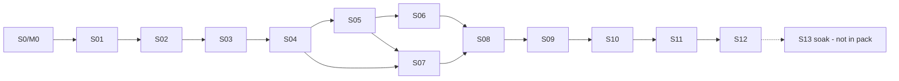

# Sprint Pack Review — Sprint-01 through Sprint-12

**Document ID:** RPM-SPRINT-REVIEW  
**Review date:** 2026-07-22  
**Scope reviewed:** `docs/sprints/Sprint-01.md` … `Sprint-12.md`  
**Normative baselines:** [10-development-roadmap.md](../10-development-roadmap.md) · [project-roadmap.md](../project-roadmap.md) · [dependency-map.md](../dependency-map.md) · [03-database-design.md](../03-database-design.md) · [04-api-specification.md](../04-api-specification.md) · [06-permission-system.md](../06-permission-system.md) · [ui/](../ui/)  
**Status:** Findings remediated in sprint files; residual gaps tracked below

---

## 1. Verdict

The Sprint-01–12 pack is a **coherent, dependency-ordered slice** of the canonical roadmap (platform → identity → inventory → residents/leases → billing → payments → reconciliation). Architecture, multi-tenant isolation rules, and milestone alignment through **M4** plus **M5 control-plane (Sprint 12)** are sound after remediation.

**Critical program caveat:** This pack is **not** a complete path to GA. Roadmap Sprints 13–24 (financial soak, ops/reporting **M6**, migration **M7**, dual pilots **M8**, security/scale **M9**, cutover/GA **M10**) are **not authored** as sprint files. Do not treat Sprint-12 completion as MVP/GA feature-complete.

---

## 2. Checklist results

| Check | Result | Notes |
|---|---|---|
| Dependency order | **Pass** (after fixes) | Linear spine S01→S12 matches [dependency-map.md](../dependency-map.md); soft parallels called out |
| Business value | **Pass** | Each sprint has a demoable operator or platform outcome; S01 is platform value (acceptable) |
| Architecture consistency | **Pass** | Modular monolith, outbox-SoT, no `X-Tenant-ID`, org-scoped JWT |
| Database consistency | **Pass** (after fixes) | Removed dual ownership of `meters` / `security_deposits`; billing jobs via `scheduled_jobs` |
| API consistency | **Pass** (minor residual) | Paths use org-scoped `/v1/...` patterns; representative not exhaustive OpenAPI |
| UI consistency | **Pass** (after fixes) | Spec links valid; portal demoted to stretch in S11 |
| Estimated timeline | **Pass with risk** | 12×2 weeks ≈ 24 weeks to S12; overloaded S10 mitigated by timebox |
| Deliverables | **Pass** | Each sprint lists shippable artifacts + handoff |
| Risks | **Pass** (after fixes) | High-risk finance/isolation covered; pack-gap risk documented |

---

## 3. Dependency order

### 3.1 Canonical chain (hard)

| Sprint | Hard predecessors | Milestone |
|---|---|---|
| 01 | M0 / Sprint 0 | → M1 |
| 02 | 01 | **M1** |
| 03 | 02 | → M2 |
| 04 | 03 | **M2** |
| 05 | 04 | → M3 |
| 06 | 05 | **M3** |
| 07 | 04, 05 (06 soft) | → M4 |
| 08 | 05–07 | → M4 |
| 09 | 08 (+07 docs) | **M4** |
| 10 | 09 | → M5 |
| 11 | 10 | → M5 |
| 12 | 10–11 | **M5 control plane** |

### 3.2 Issues found and fixed

| ID | Issue | Fix |
|---|---|---|
| D1 | Sprint-01 lacked explicit Builds-on for Sprint 0/M0 | Added Builds-on + calendar note |
| D2 | Sprint-09 listed Sprint-08 only; documents required for checkout evidence | Added Sprint-07 documents to Builds-on |
| D3 | Sprint-11 portal implied hard dependency on resident self APIs | Portal → stretch; staff-only is exit path |
| D4 | Sprint-12 referenced Sprint-13 without pack coverage | Clarified S13 not authored; backlog |

### 3.3 Acceptable soft edges (no change required)

- Sprint-07 after Sprint-06: import helps pilots but residents can start after Sprint-05.
- Sprint-14 maintenance can parallel soak historically; **not in this pack**.

---

## 4. Business value

| Sprint | Business value quality | Assessment |
|---|---|---|
| 01 | Platform | Valid: delivery risk reduction; demo = traced deploy |
| 02 | Platform + recoverability | **M1** — strong |
| 03 | First users/orgs | Strong security onboarding value |
| 04 | Multi-user safe admin | **M2** — required before data |
| 05–06 | Portfolio operable + import | **M3** — first ops value |
| 07–09 | People + contracts + lifecycle | **M4** — core product |
| 10–12 | Charge → collect → trust | M5 path — core commercial |

**Issue (accepted):** Sprint-01 “business value” is engineering leverage, not renter-facing. Retained—roadmap Phase 1 is intentional.

**Issue fixed:** Sprint-11 resident story overstated portal value; reframed as staff collection + stretch portal.

---

## 5. Architecture consistency

### Aligned

- pnpm monorepo, NestJS API + worker, React web, Postgres/Prisma, Redis non-authoritative, S3, outbox.
- Deny-by-default RBAC from Sprint-04; path `organizationId` == token `org_id`.
- Ban on caller-selected tenant headers.
- Idempotency + `If-Match` on mutating finance/lease paths.
- High-risk UX / SoD for refunds and deposit disposition (Sprint-12).

### Issues found and fixed

| ID | Issue | Fix |
|---|---|---|
| A1 | Sprint-01 said permission enforcement begins “Sprint-03/04” | Clarified: identity in S03; enforcement **S04/M2** |
| A2 | Invented `billing_runs` table not in DB design | Sprint-10 uses `scheduled_jobs` + operations/idempotency |
| A3 | Portal in S11 conflicted with “no portal until later” in S07 | S11 default staff-only |

### Residual (watch)

- Support elevation remains skeleton in S04—acceptable if no silent impersonation.
- Expenses, vehicles, payment plans correctly excluded but exist in broader API/docs—keep backlog discipline.

---

## 6. Database consistency

### Ownership matrix (canonical create sprint)

| Tables / objects | Owner sprint |
|---|---|
| Platform durability (`outbox_*`, `idempotency_keys`, `scheduled_jobs`) | 02 |
| Identity, org, membership, invite, session, MFA, audit | 03–04 |
| Portfolio, owners, agreements | 05 |
| `import_jobs` / inventory scale indexes | 06 |
| Residents, waitlist, DNR, documents | 07 |
| Leases, allocations, GiST EXCLUDE | 08 |
| Occupancy events, asset keys, checklists | 09 |
| **Meters, readings, tariffs, utility runs, invoices, ledger, security_deposits** | **10** |
| Payments, refunds, webhooks | 11 |
| Recon, disposition lines, aging aids | 12 |

### Issues found and fixed

| ID | Issue | Fix |
|---|---|---|
| DB1 | Sprint-09 and Sprint-10 both claimed `meters` / `meter_readings` | S09 checklist-only values; **S10 canonical** |
| DB2 | Sprint-09 optional `security_deposits` vs S10 canonical | Removed from S09; **S10 owns** |
| DB3 | `billing_runs` undocumented | Mapped to `scheduled_jobs` + ops |
| DB4 | `credit_note_lines` omitted in S10 list | Added alongside `credit_notes` |

### Residual

- Sprint-09 checkout reading backfill into `meter_readings` is optional in S10—must be tested if boarding-house pilots rely on move-out readings.
- Holds/reservations tables still deferred (aligned with deferred screens).

---

## 7. API consistency

### Aligned

- Versioned `/v1` resources; Problem Details; cursor pagination defaults; org isolation.
- Auth → admin → portfolio → residents/docs → leases → finance → payments → recon progression matches [04-api-specification.md](../04-api-specification.md) domain order.
- Webhook HMAC + idempotency in Sprint-11 matches architecture.

### Issues found and fixed

| ID | Issue | Fix |
|---|---|---|
| API1 | Portal self APIs treated as Sprint-11 must-have | Stretch; staff payment APIs are exit |
| API2 | Expenses endpoints absent from pack but present in API spec | Explicit out-of-scope in S10/S12 |

### Residual (documentation hygiene)

- Sprint files use abbreviated paths (`.../leases`)—acceptable for planning; OpenAPI skeleton still a recommended next design action.
- Permission key strings are illustrative; must match seeded catalog in Sprint-04 implementation.

---

## 8. UI consistency

### Aligned

- Screens reference existing `docs/ui/**` specs.
- Shell growth: auth (S03) → admin + switcher (S04) → portfolio (S05–06) → residents/docs (S07) → leasing (S08–09) → finance (S10–12).
- Cross-cutting patterns (org switch purge, high-risk confirm, Operations Center) cited.

### Issues found and fixed

| ID | Issue | Fix |
|---|---|---|
| UI1 | Sprint-11 listed portal screens as in-scope MVP | UI table: stretch / staff Pay actions |
| UI2 | Deposit disposition UI in S12 vs checklist in S09 | Intentional: S09 preview, S12 execute—clarified in DB ownership |

### Residual

- Home dashboard widgets remain thin until roadmap S15—OK.
- Approvals inbox still deferred (`ui/deferred-screens.md`)—SoD uses inline approve on payment/disposition detail.

---

## 9. Estimated timeline

| Item | Assessment |
|---|---|
| Per-sprint duration | Consistently **10 business days / 2 weeks** — matches roadmap |
| Pack calendar | Sprint-01…12 ≈ **24 weeks** after M0 (~6 months) |
| Roadmap position | Ends at roadmap Sprint 12 (recon); **~12 more roadmap sprints** to GA |
| Staffing assumption | Same as doc 10 (~8–10 FTE); overload risk on S08 allocation, S10 billing, S11 webhooks |

### Issues found and fixed

| ID | Issue | Fix |
|---|---|---|
| T1 | Sprint-10 scope (billing + utilities + deposits + credit notes) exceeds comfortable 2-week capacity | Utilities **timeboxed/stretch**; rent billing must-hit; capacity note in estimate |
| T2 | Sprint-11 portal competed with webhook chaos buffer | Portal stretch; estimate buffer protected |
| T3 | Sprint-12 duration note implied pack end = program end | Calendar note: does **not** end GA |

### Residual schedule risks (unfixed by doc alone)

- PSP KYC lead time (start M0) can still block **production** pilots after S11.
- Sprint-08 concurrency/GiST work is historically slip-prone—keep senior ownership.
- Authoring Sprint-13+ files is required before Phase 5/6 planning commits.

---

## 10. Deliverables

| Sprint | Deliverables adequacy | Gap |
|---|---|---|
| 01–04 | Complete for platform/identity | — |
| 05–06 | Inventory + import + M3 evidence | — |
| 07–09 | Residents/docs/leases/lifecycle + M4 | — |
| 10 | Billing + finance UI + runbook draft | Utilities may be stretch artifact |
| 11 | PSP sandbox + staff payments + chaos evidence | Portal optional deferral **required** if stretch cut |
| 12 | Recon + SoD + tolerance doc + runbooks | Sprint-13.md still missing |

**Issue fixed:** Sprint-11 deliverable explicitly allows written portal deferral.

---

## 11. Risks

### Cross-pack residual risks (still open)

| Risk | Severity | Mitigation |
|---|---|---|
| Pack ends before M6–M10 | High (planning) | Author Sprint-13…24 (or compressed GA program) before promising launch |
| PSP KYC delay | High | Track weekly from M0; sandbox ≠ prod |
| Sprint-10 overload | Medium | Timebox utilities (fixed in doc) |
| Double-booking regressions | High | S08 EXCLUDE + S09 renew/transfer tests |
| Financial correctness | High | S10–12 controls + S13 soak |
| PII/document malware | Medium | S07 scan states + redaction |
| Org-switch cache leak | High | S04 isolation e2e |
| Sales overclaim (owner payouts, trust accounting) | Medium | Explicit exclusions retained |

### Issues found and fixed in sprint risk tables

- S09: no fake deposit ledger.
- S10: utility overload risk added.
- S11: portal-without-linkage risk added.
- S12: soak scope creep and missing S13 file called out.

---

## 12. Remediation log (applied this review)

| File | Changes |
|---|---|
| [Sprint-01.md](./Sprint-01.md) | Builds-on M0; RBAC timing clarification |
| [Sprint-08.md](./Sprint-08.md) | Split money storage ADR vs Sprint-10 billing policy |
| [Sprint-09.md](./Sprint-09.md) | Remove meter/deposit table ownership; checklist-only readings; Builds-on docs; deliverable/risk fixes |
| [Sprint-10.md](./Sprint-10.md) | Canonical meters/deposits; `scheduled_jobs`; `credit_note_lines`; expenses OOS; utilities timebox; capacity note |
| [Sprint-11.md](./Sprint-11.md) | Staff-only default; portal stretch; dependency/risk/estimate/AC updates |
| [Sprint-12.md](./Sprint-12.md) | M5 control-plane vs soak; expenses/ops OOS; pack calendar; S13 backlog |

---

## 13. Program coverage gap (not fixed in Sprint-01–12)

Required next sprint documents (per [10-development-roadmap.md](../10-development-roadmap.md)):

| Roadmap sprint | Outcome |
|---|---|
| **13** | Financial soak & replay → **M5 complete** |
| **14–15** | Maintenance, notifications, dashboards/reports → **M6** |
| **16–17** | Migration rehearsals → **M7** |
| **18–19** | Dual pilots → **M8** |
| **20–21** | Pen-test + 10k gate → **M9** |
| **22–24** | Cutover + stabilization → **M10 / GA** |

Also still outside pack: expenses UI/API delivery, resident portal full IA, approvals inbox, holds/reservations, SSO (Phase 2+).

---

## 14. Review closure

This review is **closed for Sprint-01–12 documentation quality** when:

1. Remediation log items are present in the sprint files (**done**).
2. Stakeholders accept that **Sprint-12 ≠ GA** and Sprint-13+ must be planned.
3. Finance SME pre-agrees recon tolerance before Sprint-12 execution.
4. PSP KYC remains a tracked external dependency from M0.

Implementation must not begin from informal chat—only from these sprint docs plus approved ADRs and the normative 00–11 specification set.
