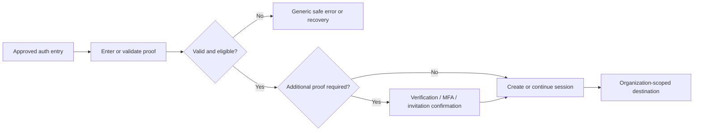

# Forgot Password

**Domain:** Auth  
**Status:** Implementation-ready UX specification  
**Normative references:** [UI Design](../../07-ui-design.md) · [API Specification](../../04-api-specification.md) · [Permission System](../../06-permission-system.md) · [Design System](../../design-system.md)

## Overview

### Purpose
Support the complete forgot password task with clear context, guarded actions, and durable outcomes.

### Target users
Workforce users and Residents authenticating through their respective entry surface.

### Entry points
- Direct approved application URL for workforce or Resident sign-in.
- Session-expiry, logout, protected-route redirect, password-recovery email, verification email, MFA continuation, or invitation link as appropriate.
- Return destination is allowlisted and restored only after authentication; tokens and sensitive values are never copied into analytics, titles, logs, or arbitrary redirects.

**API alignment:** `POST /auth/password/forgot`. Collection pages use bounded cursor pagination (default 25, maximum 100); writes use `If-Match` and/or `Idempotency-Key` exactly where API §7 marks them. Errors map from RFC 9457 Problem Details and stable domain codes.  
**Authorization:** Public or authenticated-self flow; no Organization data is disclosed before identity, membership, and challenge validation. UI checks shape discoverability only; the server remains authoritative.

## Layout

## Desktop Layout
Public authentication shell with product mark, language/theme controls, and a centered 400–440 px card. No staff sidebar, Organization context bar, global search, or notifications appear before authentication. Keep legal/help links outside the card and the primary form above the fold.

## Tablet Layout
Centered card with 24 px outer gutters and no persistent navigation. Preserve the same reading order and avoid split-screen marketing content that pushes recovery or MFA controls below the fold.

## Mobile Layout
Single-column full-height public shell, 16 px gutters, safe-area padding, and a full-width primary action. The software keyboard must not cover the focused field or error summary.

## Responsive Breakpoints
- **0–767 px:** single-column public shell.
- **768–1279 px:** centered authentication card.
- **≥1280 px:** centered card; optional restrained trust/help panel, never sensitive account hints.
At 200% zoom and 400% reflow, content remains one column.

## Navigation

### Breadcrumb
N/A: authentication is a shallow public flow. Use a “Back to sign in” text link where recovery or verification needs reversal.

### Sidebar
N/A: no authenticated sidebar is rendered.

### Header
Product mark, English/Vietnamese language switch, theme control, and accessible help link. Do not display an Organization name until membership eligibility is proven.

## User Flow

## Components

- **Cards:** compact summary/exception cards with scope, value, time basis, and drill-down; avoid decorative KPI cards.
- **Tables:** semantic server-driven table/data grid with configurable columns, sticky header, sort state, row selection, and accessible pagination.
- **Forms:** persistent labels, help/error text, grouped fieldsets, error summary, unsaved-change guard, and server-conflict recovery.
- **Dialogs:** reserved for short confirmations, reason capture, or irreversible consequences; never contain a long workflow.
- **Drawers:** contextual create/edit/detail on desktop; become full-screen sheets on mobile.
- **Tabs:** only for peer sections of one resource; URL-addressable, keyboard operable, and not used to hide required steps.
- **Dropdowns:** menus for actions; searchable comboboxes for entity selection. Never place required explanations only in a tooltip.
- **Date pickers:** locale-aware date or date-time controls with text-entry fallback, explicit Property time zone, and start-inclusive/end-exclusive help where relevant.
- **Charts:** include legend, values, as-of/freshness, accessible text summary, and data-table alternative; never rely only on color.
- **Pagination:** cursor-based Previous/Next with page-size 25/50/100 when supported; preserve filters and announce result changes.

## Form Design

### Field list
The primary record is read-oriented; filters, inline notes, and permitted quick actions remain forms. Fields and controls: Email (required); approved return destination is server-selected and never accepted as an arbitrary URL.

### Validation rules
Validate required/type/range locally, then treat server validation as authoritative. Dates must form a valid effective period; money is a decimal string with explicit ISO currency; entity choices must be in active Organization and permitted Property scope. Preserve input on recoverable errors. Surface duplicate, stale-version, capacity, immutable-record, consent, scan, and closed-period conflicts beside the affected field plus in an error summary.

### Required fields
Required fields are marked in labels and announced programmatically. Asterisks are accompanied by “Required” semantics. Workflow completion additionally requires all policy-dependent evidence, acknowledgements, and approvals returned by capability metadata.

### Default values
Default Organization and Property scope from the shell; dates from the applicable Property business date; locale/time zone/currency from effective Organization or Property configuration. Never default consent, destructive choices, approval decisions, override reasons, or a financial currency inferred only from locale.

### Error messages
Use corrective language: “Enter an end date after the start date,” “This Unit is no longer available for the selected period,” or “The record changed; review the latest version.” Include a stable support reference for unexpected failures; never expose raw provider, SQL, stack, token, internal tenant ID, or unauthorized resource details.

### Disabled states
Disable during an in-flight non-idempotent submit; explain lifecycle, permission, subscription, dependency, or approval blockers inline. Prefer hiding actions the user can never perform and disabling discoverable actions that can become available. Read-only fields remain selectable/copyable and visually distinct from disabled inputs.

## Table Design

### Columns
Related-record tables use: Authentication screens do not expose business-record tables. Any Organization chooser uses Name, secondary identifier, membership role, and status. The primary record itself uses a description list, not a one-row table.

### Sorting
Server-side, single primary sort from the API allowlist with a unique stable tie-breaker. Display sort direction via text/ARIA as well as icon; preserve sort in the URL.

### Filtering
Permission-safe filters use Property, status, type, effective date/as-of, owner/assignee, and domain criteria. Display active filters as removable chips and provide Clear all. Filter counts never leak unauthorized records.

### Search
Debounce 250–400 ms after two characters except exact-reference search, with a clear button and keyboard submit. Search approved indexed identifiers and names only; describe the searchable fields.

### Pagination
Cursor pagination; default 25 rows and maximum 100. Do not show invented page numbers when the API cannot provide stable totals. Keep the current cursor/filter snapshot when returning from detail.

### Bulk actions
Show selected and excluded counts, scope, permission/lifecycle exclusions, preview, and asynchronous progress. Jobs are safe to leave and continue in Operations Center. Retrying targets failed items only.

### Export
Export is a separate governed action, not “download current DOM.” Show scope, filters, fields, estimated size, purpose, format, expiry, classification, and whether step-up/approval is required. Audit creation and download.

## Button Actions

### Primary
**Edit or perform the next valid lifecycle action.** Use one emphasized button with a specific verb and disabled/loading text that communicates progress.

### Secondary
Save draft, cancel, preview, refresh, edit filters, download authorized evidence, or navigate to related records. Cancel preserves a safe draft where policy permits and warns about unsaved consequential changes.

### Dangerous
Archive, revoke, terminate, void, reverse, delete, reject, or cancel a running operation only when valid. Confirmation names the resource and scope, explains additive/irreversible effects, captures a reason, and requests step-up or approval when returned by policy. Posted financial, issued, signed, and audited records are never destructively edited.

## States

### Loading
Preserve shell and known scope; use structure-matched skeletons for initial load, local spinners for refresh, and progress with counts/operation ID beyond a few seconds. Prevent duplicate submission.

### Skeleton
Match final title, summary, filter, and row/card geometry; do not display fabricated monetary or status content.

### Empty
Distinguish first use, no filter results, no current relationship, unavailable dependency, and restricted scope. Offer one relevant action and do not imply that unauthorized data does not exist.

### Error
Keep entered data and successful modules. Distinguish validation, stale version, business conflict, permission change, throttling, dependency outage, and internal error. Retry only safe/idempotent operations.

### Success
Confirm near the action and persist important outcomes in-page. Show stable resource/operation reference, effective time, audit-relevant status, and next action.

### Permission denied
Use a non-disclosing not-found state for cross-Organization/out-of-scope resources. For a known destination with insufficient permission, identify the missing capability in user language, current scope, and who can grant access—without exposing protected data.

### No internet
Show a persistent offline banner and last-known freshness. Read-only cached shell content may remain if policy allows; financial posting, Lease lifecycle, role/security changes, exports, and other high-risk writes are blocked. Only explicitly supported maintenance/inspection drafts may queue.

## Theme

### Light mode
Use neutral canvas/surface hierarchy, subtle borders, restrained shadows, and semantic foreground/background pairs from the design system. Financial and status values retain text labels.

### Dark mode
Use designed dark tokens rather than inversion. Reduce large-area contrast, preserve 4.5:1 text and 3:1 essential graphical contrast, avoid pure black/white, and give charts/pickers/focus/error states dedicated dark palettes.

## Internationalization

### English
Sentence case, direct verbs, explicit entity names, ISO currency labels where ambiguity exists, and concise consequence-first confirmations.

### Vietnamese
Provide complete `vi` translations, locale formatting, Vietnamese diacritics in search, and reviewed financial/legal terminology. Canonical labels: Organization = **Tổ chức**, Resident = **Cư dân**, Lease = **Hợp đồng thuê**, Unit = **Căn/Đơn vị cho thuê**, Bed = **Giường**, Property Owner = **Chủ sở hữu bất động sản**. Product glossary wins over ad hoc abbreviations.

### Long text handling
Allow at least 35% expansion, wrap labels/chips, clamp only secondary preview text with an accessible full-text mechanism, and never truncate names, money, errors, legal text, or action consequences without access to the complete value.

## Accessibility

### Keyboard navigation
Logical landmarks and heading order; skip link; tab/shift-tab for controls; arrow-key patterns only for composite widgets; Escape closes overlays; dialogs trap then restore focus. Data-grid shortcuts are documented and never required.

### Focus states
Use a 2 px high-contrast focus ring with 2 px offset, visible against both themes and not obscured by sticky content. On validation, focus the error summary, then link to each invalid field.

### Color contrast
WCAG 2.2 AA: 4.5:1 normal text, 3:1 large text and essential UI graphics. Status, trend, selection, and error meaning always include icon/text/pattern beyond color.

### ARIA considerations
Prefer native elements. Provide accessible names/descriptions, `aria-current` for navigation, `aria-sort` for sortable headers, polite live regions for results/progress, assertive only for urgent failures, and accessible chart/table alternatives. Virtualized rows expose correct position/count.

## UX Notes

### Best practices
- Keep active Organization, Property scope, currency, time zone, date/as-of, and read-only/support context visible.
- Distinguish Resident identity, physical occupancy, and Lease responsibility.
- Use Unit for apartment/room and optional Bed beneath a shared Unit; never introduce a Room entity.
- A Meter always uses `meterType=ELECTRICITY|WATER`.
- Preserve traceability: preview consequential changes, show immutable references, and route long work to Operations Center.

### Animations
Use 120–180 ms opacity/transform transitions for menus, drawers, and row insertion; 180–240 ms for larger panels. Avoid layout-shifting animation in dense grids and financial totals. Progress is determinate when counts exist.

### Transition suggestions
Preserve list filters/scroll when opening and returning from detail. Use a brief highlight for updated rows, optimistic UI only for low-risk reversible preferences, and server-confirmed transitions for financial, permission, Lease, occupancy, and document actions. Respect `prefers-reduced-motion` by removing nonessential motion.
